# Samy Ben Hamida -- Projet SamyDessert

---

## Table des matieres

1. Présentation personnelle et du projet SamyDessert
    - 1.1 Qui suis-je et mon parcours
    - 1.2 Genèse du projet et vision
    - 1.3 Objectifs du projet
    - 1.4 Nature du projet
2. Cahier des charges et recueil du besoin
    - 2.1 Contexte et besoin
    - 2.2 Public cible
    - 2.3 Fonctionnalités principales
    - 2.4 Contraintes du projet
    - 2.5 Étude de faisabilité
4. Spécifications fonctionnelles
    - 4.1 Fonctionnalités côté visiteur
    - 4.2 Fonctionnalités côté utilisateur connecté
    - 4.3 Fonctionnalités liées à la commande
    - 4.4 Fonctionnalités d'administration
5. Méthodologie de conception
    - 5.1 Démarche de conception
    - 5.2 User stories
6. Conception UX/UI
    - 6.1 Analyse et inspiration
    - 6.2 Personas utilisateurs
    - 6.3 User flow
    - 6.4 Choix visuels et accessibilité
    - 6.5 Identité visuelle
    - 6.6 Design system
    - 6.7 Wireframes et maquettes
7. Architecture technique
    - 7.1 Stack technologique
    - 7.2 Outils et services complémentaires
    - 7.3 Cycle de traitement d'une requête (MVC)
8. Chiffres du projet et état des fonctionnalités
    - 8.1 Chiffres clés
    - 8.2 État des fonctionnalités
9. Développement front-end
    - 9.1 Approche Atomic Design
    - 9.2 Les atomes
    - 9.3 Les molécules
    - 9.4 Les organismes
    - 9.5 Le carousel
    - 9.6 Les controllers Stimulus
    - 9.7 Architecture CSS -- Tailwind v4 et design tokens
10. Conception de la base de données
11. Développement back-end
    - 11.1 Controllers PHP
    - 11.2 Services
    - 11.3 Le reste de src/
12. Accessibilité
    - 12.1 Typographie Luciole
    - 12.2 Contrastes de couleurs
    - 12.3 Navigation clavier
    - 12.4 Attributs ARIA et HTML sémantique
    - 12.5 Outils d'accessibilité utilisés
13. Sécurité
    - 13.1 Authentification et gestion des utilisateurs
    - 13.2 Inscription et vérification d'e-mail
    - 13.3 Contrôle de l'état du compte
    - 13.4 Protection des formulaires et des actions sensibles
    - 13.5 Sécurisation de l'espace client
    - 13.6 Paiement en ligne avec Stripe
    - 13.7 Gestion des secrets et configuration
    - 13.8 Limites actuelles et améliorations possibles
14. Tests
15. Commandes utiles
16. Gestion de version avec Git
    - 16.1 Pourquoi Git
    - 16.2 Stratégie de branches
    - 16.3 Commandes Git utilisées
    - 16.4 Conventions de commit
17. Déploiement
    - 17.1 Environnement de développement avec Docker
    - 17.2 Variables d'environnement
    - 17.3 Déploiement en production
18. Évolution du projet
    - 17.1 Fonctionnalités à compléter
    - 17.2 Améliorations techniques
    - 17.3 Infrastructure et déploiement
18. Bilan et conclusion
19. Remerciements


---

## 1. Présentation personnelle et du projet SamyDessert

---

### 1.1 Qui suis-je et mon parcours

Je m'appelle Samy Ben Hamida, j'ai 34 ans. Apres l'obtention d'un baccalaureat scientifique, j'ai effectue une première annee d'études en informatique a l'universite Paris Descartes.

Je suis aujourd'hui en formation de développeur web et web mobile a l'ESRP Auxilia, dans le cadre d'un parcours en alternance. Cette formation s'organise avec un rythme d'une semaine en centre et une semaine en stage.

J'effectue mon stage au sein de l'association Creative Handicap, qui a pour objectif de rendre l'art et les metiers du numerique accessibles a tous, notamment a travers des formations en design web.

Je suis une personne calme, motivee, avec un bon esprit d'equipe. J'apprecie les defis et je dispose d'une bonne capacite d'analyse et de logique.

### 1.2 Genèse du projet et vision

Le projet SamyDessert est ne de ma passion pour les desserts faits maison. J'ai l'habitude de preparer des desserts que je partage avec mes collegues, ce qui m'a permis de constater un interet reel pour des recettes simples et accessibles.

J'ai identifié plusieurs problemes dans les plateformes existantes : certaines sont complexes, peu accessibles ou proposent des recettes couteuses et difficiles a reproduire. A l'inverse, les plateformes de commande ne permettent pas toujours de comprendre ou reproduire les recettes.

### 1.3 Objectifs du projet

SamyDessert a pour objectif de proposer une plateforme hybride. L'utilisateur peut soit consulter des recettes simples, economiques et faciles a réaliser, soit commander directement des desserts pour une livraison rapide.

Une attention particuliere est portee a l'accessibilité du site afin de garantir une expérience claire, fluide et comprehensible pour tous.

### 1.4 Nature du projet

Le projet SamyDessert est un projet de fin de formation a visee professionnelle. Il s'agit d'un projet fictif, mais conçu pour repondre a un besoin reel.

Le site repose sur un concept hybride : proposer des recettes de cuisine gratuites afin d'attirer les utilisateurs, tout en offrant la possibilite de commander des gateaux faits maison, simples et accessibles.

Cette approche permet de créer une valeur ajoutée en combinant contenu gratuit (recettes) et offre commerciale (vente de desserts), dans une logique proche de certains modeles existants sur le web.


---

## 2. Cahier des charges et recueil du besoin

---

### 2.1 Contexte et besoin

Lors de l'analyse des sites existants, plusieurs problèmes ont été identifiés : certaines plateformes sont complexes a utiliser, peu accessibles, et les recettes proposées sont souvent couteuses ou difficiles a reproduire. Les sites de vente de desserts ne permettent généralement pas de comprendre comment les produits sont réalisés, ce qui limite l'intérêt pour l'utilisateur.

Le besoin est donc de concevoir une plateforme simple, accessible et claire, combinant une dimension pédagogique (recettes gratuites) et une dimension commerciale (commande de desserts faits maison).

### 2.2 Public cible

Le site s'adresse principalement a :

- des particuliers souhaitant commander des desserts pour un usage personnel ou événementiel
- des personnes interessees par la cuisine maison et les recettes simples
- des utilisateurs recherchant une interface accessible et facile a utiliser

### 2.2 Fonctionnalités principales

Le site propose trois grands ensembles de fonctionnalités, détailles dans la section 4 (Spécifications fonctionnelles) :

- **Côté visiteur** : consultation du catalogue et des recettes, inscription, formulaire de contact
- **Côté utilisateur connecté** : panier, commande en ligne avec paiement Stripe, espace personnel, favoris, avis
- **Côté administration** : gestion complète du contenu,des utilisateurs et des commandes via EasyAdmin

### 2.2 Contraintes du projet

Le projet doit respecter plusieurs contraintes :

- utilisation de technologies modernes (Symfony, Twig, Tailwind, Docker)
- respect des bonnes pratiques de sécurité
- prise en compte de l'accessibilité (contrastes, navigation clavier, structure HTML)
- conception responsive (mobile, tablette, desktop)
- structuration du code pour garantir sa maintenabilite et son evolutivite

### 2.2 Étude de faisabilité

Ce type de projet est aujourd'hui très accessible : les technologies utilisées (Symfony, MySQL, Docker, Stripe) sont toutes open source, bien documentées, et accompagnées d'une grande communauté en ligne. Il existe une quantité importante de tutoriels, de forums, de packages prêts a l'emploi et d'exemples concrets qui facilitent le développement. Les outils d'intelligence artificielle ont également servi de support pour débloquer certaines situations ou explorer des solutions rapidement. Le périmètre fonctionnel — catalogue, panier, commande, recettes — est cohérent et tout a fait réalisable par un développeur seul dans le cadre de la formation.

---

## 3. Spécifications fonctionnelles

---

### 3.1 Fonctionnalités côté visiteur (non connecté)

Le visiteur peut acceder librement au contenu du site sans authentification.

Il peut :
- consulter la page d'accueil avec les produits mis en avant
- naviguer dans le catalogue de desserts
- consulter les fiches produits
- consulter les recettes de cuisine
- effectuer une recherche par mot-cle
- filtrer les contenus par catégorie
- acceder au formulaire de contact
- créer un compte utilisateur

### 3.2 Fonctionnalités côté utilisateur connecté

Une fois connecté, l'utilisateur dispose de fonctionnalités supplementaires liées a son compte.

Il peut :
- ajouter des produits au panier, modifier les quantites ou les supprimer
- consulter le contenu du panier en temps reel (sidebar dynamique)
- passer une commande en ligne (adresse de livraison → récapitulatif → paiement Stripe)
- recevoir un email de confirmation apres paiement
- consulter l'historique de ses commandes depuis son espace personnel
- annuler une commande confirmee depuis son espace personnel
- ajouter ou retirer des produits **et des recettes** de ses favoris
- laisser un avis et une note sur un produit (une seule fois par produit)
- acceder a son espace personnel (compte, commandes, favoris)

### 3.3 Fonctionnalités liées à la commande

Le processus de commande est structure en plusieurs étapes :
- saisie de l'adresse de livraison
- affichage du récapitulatif de la commande
- redirection vers le paiement securise via Stripe
- confirmation de la commande apres paiement

Le système garantit la coherence des données en recalculant le total côté serveur et en securisant les echanges avec Stripe.

### 3.4 Fonctionnalités d'administration

L'interface d'administration est réalisée avec **EasyAdmin** et est accessible uniquement aux comptes ayant le rôle `ROLE_ADMIN`.

Elle comprend :

- **Tableau de bord** : statistiques en temps reel (nombre de produits, commandes, utilisateurs) et apercu des 5 dernieres commandes
- **Gestion des produits** : ajout, modification (nom, prix, description, catégorie, image via upload), suppression, activation/desactivation
- **Gestion des recettes** : ajout, modification (contenu, image, catégorie, difficulté), suppression
- **Gestion des commandes** : liste triee par date, modification du statut
- **Gestion des utilisateurs** : liste et modification des comptes
- **Gestion des avis clients** : moderation des avis laisses par les utilisateurs

---

## 4. Méthodologie de conception

---

### 4.1 Démarche de conception

J'ai commencé par le front-end — interfaces, composants, design — pour avoir quelque chose de concret a montrer rapidement, puis j'ai construit le back-end derrière au fur et a mesure des besoins.

La première étape a été d'identifier les utilisateurs cibles via la définition de personas, ce qui a permis de prioriser les fonctionnalités à développer.

La conception UX/UI a ensuite été réalisée dans Figma, en suivant une approche mobile-first, avec des maquettes pour trois breakpoints : mobile, tablette et desktop. Un début de design system a été mis en place en parallèle : tokens de couleurs, typographie et composants réutilisables.

Le développement a démarré par la mise en place de l'architecture technique (Symfony, Docker, base de données), puis par la construction des composants front-end selon la méthode Atomic Design : d'abord les atomes, puis les molécules, puis les organismes, et enfin les pages complètes.

---

## 5. Conception UX/UI avec Figma

---

### 5.1 Analyse et inspiration

Une phase d'analyse a été réalisée a partir de sites existants afin d'identifier les bonnes pratiques en matiere d'UX.

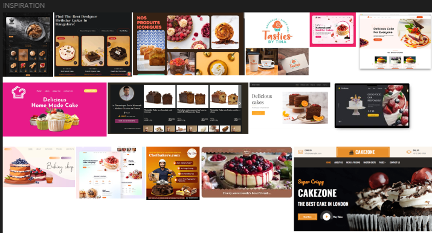

### 5.2 Personas utilisateurs

Des personas ont été définis pour représenter les differents types d'utilisateurs.

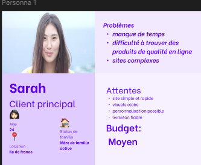
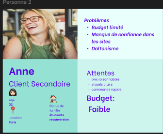

### 5.3 User flow

Un user flow a été conçu pour modeliser le parcours utilisateur.

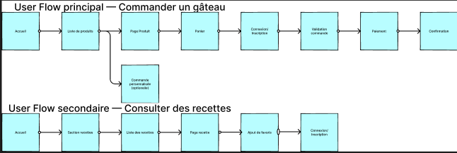

### 5.4 Choix visuels et accessibilité

Une palette de couleurs coherente a été définie avec differentes teintes. La typographie **Luciole** a été choisie pour améliorer la lisibilite et l'accessibilité.

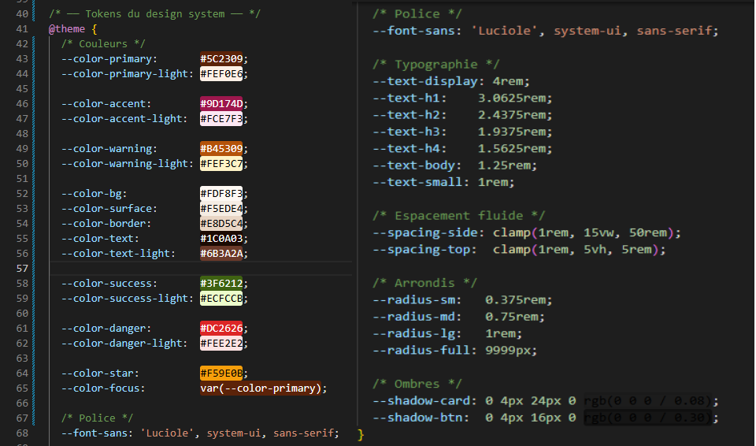

### 5.5 Identité visuelle

Le logo du projet a été conçu avec **Affinity Designer** en coherence avec la palette de couleurs.
(captures/logo.png) 
### 5.6 Design system

Un mini design system a été mis en place avec des composants réutilisables et des variables de couleurs.
*capture de composant a faire et variable couleur sur figma *
![Design system — tokens et composants]

### 5.7 Wireframes et maquettes

Les interfaces ont été conçues en mobile-first, puis adaptees tablette et desktop.

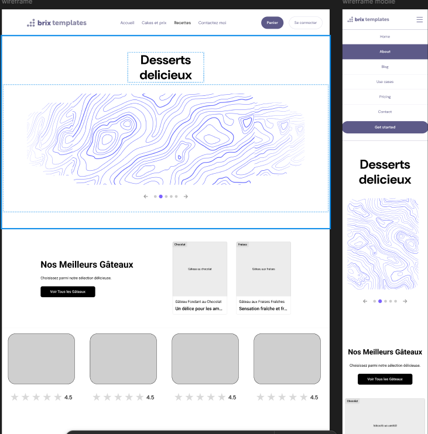
*faire plus de wireframe capture
---

## 6. Architecture technique

---

### 6.1 Stack technologique

**Back-end**

Le projet repose sur **Symfony 7.4 (LTS)** et **PHP 8.3**. Symfony structuré le projet autour du patron MVC et offre un ecosysteme de bundles qui évite de réécrire des fonctionnalites courantes :

| Bundle | Rôle |
|--------|------|
| `doctrine/orm` + `DoctrineBundle` | ORM — correspondance entités PHP ↔ tables MySQL |
| `symfony/security-bundle` | Authentification, rôles, hachage des mots de passe |
| `symfony/mailer` | Envoi d'emails transactionnels (confirmation, inscription) |
| `symfony/form` | Création et validation des formulaires |
| `symfony/twig-bundle` | Moteur de templates Twig |
| `symfony/ux-twig-component` | Composants Twig avec logique PHP (Atomic Design) |
| `symfony/ux-live-component` | Composants réactifs sans JavaScript (panier, bouton) |
| `symfony/ux-turbo` | Navigation rapide + Turbo Frames sans rechargement |
| `easycorp/easyadmin-bundle` | Interface d'administration générée automatiquement |
| `vich/uploader-bundle` | Gestion des uploads d'images (produits, recettes) |
| `stripe/stripe-php` | Intégration paiement Stripe Checkout |
| `dompdf/dompdf` | Génération de factures PDF |

**Front-end**

**Tailwind CSS v4** (JIT) pour les styles utilitaires, configuré entièrement dans `assets/styles/app.css` sans fichier de configuration externe. **Stimulus** pour les interactions côté client : 10 controllers légers attachés directement au HTML.

La gestion des assets repose sur **AssetMapper**, l'outil natif de Symfony (remplace Webpack Encore) : import maps navigateur, pas d'étape de bundling.

**Base de données**

**MySQL 8** géré par **Doctrine ORM**. Les entités PHP correspondent aux tables, les repositories encapsulent les requêtes, et les migrations versionnent les changements de schéma.

**Environnement de développement**

L'environnement est entièrement conteneurisé avec **Docker Compose** (6 services : nginx, php-fpm, mysql, adminer, init, assets). Cela garantit que le projet fonctionne de manière identique sur toutes les machines, sans installation locale de PHP ou MySQL. Voir la section Déploiement pour le détail.

### 6.2 Outils et services complémentaires

- **Stripe** est utilisé pour gérer les paiements en ligne de maniere securisee.
- **VichUploaderBundle** géré l'upload et le stockage des images produits et recettes.

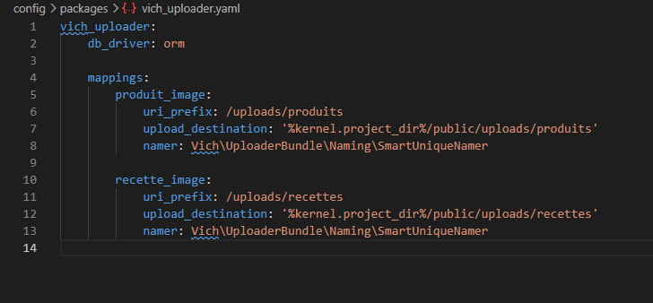

- **DBDiagram** est utilisé pour concevoir le schema de la base de données.
- **Mailtrap** permet de tester l'envoi d'emails en environnement de développement.
- Des outils comme **Coolors**, **Adobe Color** et **Colorable** ont été utilisés pour définir et tester les palettes de couleurs.
- **Unsplash** est utilisé comme source d'images libres de droits pour les produits et les recettes.

### 6.3 Cycle de traitement d'une requête (MVC)

SamyDessert suit le patron d'architecture **MVC** (Model-View-Controller), qui séparé le code en trois responsabilites distinctes : les données, la logique metier et l'affichage. Symfony impose naturellement ce decoupage.

Lorsqu'un utilisateur chargé une page ou soumet un formulaire, voici ce qui se passe :

1. **Requete HTTP** : le navigateur envoie une requête (ex : `GET /produits`).
2. **Route** : Symfony analyse l'URL et determine quelle action executer. Chaque route est définie avec l'attribut `#[Route]` directement sur la méthode du controller.
3. **Controller** : il recoit la requête, orchestre le traitement et ne contient pas de logique metier. Par exemple, `ProduitsController` recupere les produits, applique les filtrés et transmet les données au template.
4. **Service** : si une logique complexe est nécessaire, le controller delegue au service concerne. `PanierService` géré le panier en session, `MailerService` envoie les emails transactionnels, `FactureService` généré les factures PDF.
5. **Repository** : les données sont lues ou modifiées en base via les repositories Doctrine. Par exemple, `ProduitRepository::findMeilleursVendus()` calcule les produits les plus vendus via une requête SQL personnalisée.
6. **Entité** : les objets PHP (`Produit`, `Commande`, `Utilisateur`...) representent les données et sont gérés par Doctrine ORM, qui assure la correspondance avec les tables MySQL.
7. **Vue Twig** : le controller appelle `$this->render('produits/index.html.twig', [...])`. Twig généré le HTML final en utilisant les composants Atomic Design et l'envoie au navigateur.

Ce decoupage garantit que chaque partie du code a une responsabilite claire : le controller ne touche pas a la base de données directement, le template ne contient pas de logique metier, et les services sont réutilisables entre plusieurs controllers.

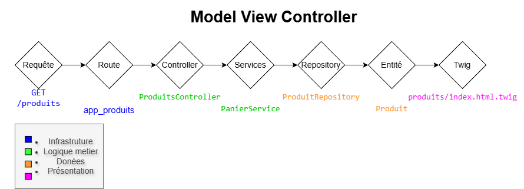

---

## 7. Développement front-end

---

### 8.1 Approche Atomic Design

Le front-end est base sur une approche **Atomic Design**. Les composants les plus simples (atomes) ont été developpes en premier sous forme de composants Twig. Ces atomes incluent notamment : boutons, inputs, labels, liens, images et icones.

Chaque composant est conçu pour etre réutilisable, coherent et accessible. **Tailwind CSS** est utilisé pour le style, permettant une intégration rapide et responsive.

### 8.2 Les atomes -- les plus petites briques de l'interface

#### Qu'est-ce qu'un atome ?

Pour construire l'interface de SamyDessert, je me suis base sur une méthode de conception appelee **Atomic Design**, créée par Brad Frost. L'idee est simple : on commence par les éléments les plus petits (les atomes), on les assemble pour former des blocs plus complexes (les molécules), et ainsi de suite jusqu'aux pages complètes.

Un atome, c'est l'élément le plus basique qu'on ne peut pas decouper davantage : un bouton, un champ de texte, une icone. Seul, il ne fait pas grand-chose. Mais une fois combine avec d'autres atomes, il permet de construire toute une interface.

Dans mon projet, j'ai implemente ces atomes en utilisant **Symfony UX Twig Components**. Concretement, chaque atome est compose de deux fichiers : une classe PHP qui définit ses options configurables, et un template Twig qui généré le HTML final.

#### Les atomes créés

J'ai developpe **14 atomes** au total, chacun correspondant a un élément HTML precis :

| Atome        | Balise HTML                  | Rôle                                        |
|--------------|------------------------------|---------------------------------------------|
| Button       | `<button>`                   | Bouton d'action avec variantes de style     |
| ButtonIcon   | `<button>`                   | Bouton circulaire avec icone seule          |
| Input        | `<input>`                    | Champ de saisie (texte, email, mot de passe) |
| Textarea     | `<textarea>`                 | Zone de texte multiligne                    |
| Select       | `<select>`                   | Liste deroulante                            |
| Checkbox     | `<input type="checkbox">`    | Case a cocher                               |
| Label        | `<label>`                    | Libelle d'un champ de formulaire            |
| Link         | `<a>`                        | Lien hypertexte                             |
| Image        | ``                      | Image avec chargément optimise              |
| Icon         | `<i>`                        | Icone Font Awesome                          |
| Badge        | `<span>`                     | Etiquette coloree (statut, catégorie)       |
| Spinner      | `<svg>`                      | Animation de chargément                     |
| StarRating   | `<div>`                      | Affichage lecture seule d'une note sur 5    |

#### Conception des atomes

**Separer la logique du style**

Pour chaque atome, j'ai séparé ce qui releve de la logique (géré en PHP) et ce qui releve du HTML pur (géré via les attributs Twig). Par exemple, pour le bouton, j'ai declare en PHP uniquement ce qui change son comportement : la variante visuelle, la taille, l'état desactive. Tout le reste -- l'id, le name, les attributs data-* -- passe directement sans etre redeclare.

```php
final class Button {
    public string $variant  = 'primary'; // primary | secondary | ghost | danger
    public string $size     = 'md';      // sm | md | lg
    public bool   $disabled = false;
    public bool   $loading  = false;
}
```

Grace a ca, les atomes restent simples et réutilisables dans n'importe quel contexte.


**Des styles flexibles mais coherents**

Pour gérer les styles CSS, j'ai utilisé une méthode proposee par Symfony UX : `attributes.defaults()`. Elle permet de définir des styles par défaut sur chaque atome, tout en laissant la possibilite de les modifier depuis l'exterieur si besoin. Ainsi, tous les boutons ont le meme aspect de base, mais on peut adapter leur style selon le contexte sans toucher au composant.

**L'accessibilité, intégrée des le depart**

Des la conception des atomes, j'ai veille a respecter les bonnes pratiques d'accessibilité :

- **Navigation au clavier** : j'utilisé `focus-visible:outline` plutot que `focus:outline`, ce qui affiché le contour uniquement lors de la navigation clavier, sans perturber l'expérience souris.
- **Champs invalidés** : le style d'erreur (bordure rouge) s'applique automatiquement via l'attribut `aria-invalid`, sans JavaScript.
- **Icones decoratives** : quand une icone est purement visuelle, je lui ajouté `aria-hidden="true"` pour qu'elle ne soit pas lue par les lecteurs d'ecran.
- **Spinner** : j'ai ajouté `rôle="status"` et `aria-live="polite"` pour que les technologies d'assistance annoncent le chargément en cours.

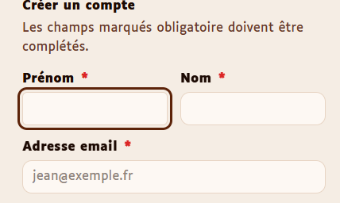

**Les états visuels des champs de formulaire**

Les champs Input, Textarea et Select partagent tous les memes états visuels, définis uniquement en CSS :

| État         | Effet visuel                  |
|--------------|-------------------------------|
| Normal       | Fond creme, bordure grise     |
| En focus     | Contour framboise             |
| Invalidé     | Bordure rouge                 |
| Lecture seule| Fond semi-transparent         |
| Desactive    | Fond gris, curseur bloque     |


#### Exemple concret : le Button

Le composant Button est un bon exemple de ce que j'ai voulu mettre en place sur l'ensemble du projet. Il propose quatre variantes visuelles, trois tailles, et un état de chargément. Quand loading est active, un spinner apparait automatiquement, le bouton se desactive, et l'attribut `aria-busy="true"` est ajouté pour informer les lecteurs d'ecran que l'action est en cours.


Ces 13 atomes forment le vocabulaire visuel de toute l'application. Chaque élément d'interface que l'utilisateur voit ou avec lequel il interagit est construit a partir de l'un d'eux.

### 8.3 Les molécules -- assembler les atomes en blocs fonctionnels

#### Qu'est-ce qu'une molécule ?

Dans la logique Atomic Design, une molécule est un groupe d'atomes qui fonctionnent ensemble pour remplir une fonction precise. Par exemple, un champ de formulaire complet est une molécule : il combine un Label (atome), un Input (atome) et un message d'erreur pour former un bloc coherent et réutilisable.

#### Les molécules créées

J'ai developpe **20 molécules** au total :

| Molecule         | Atomes composes                    | Rôle                                                   |
|------------------|------------------------------------|---------------------------------------------------------|
| InputField       | Label + Input                      | Champ de saisie complet avec label, aide et erreur      |
| TextareaField    | Label + Textarea                   | Zone de texte complète avec label, aide et erreur        |
| SelectField      | Label + Select                     | Liste deroulante complète avec label, aide et erreur     |
| CheckboxField    | Checkbox + Label                   | Case a cocher avec label et message d'erreur             |
| RadioGroup       | Label + inputs radio               | Groupe de boutons radio avec legende et validation       |
| FormField        | Label + bloc generique             | Champ de formulaire generique (wrapper réutilisable)     |
| FormFieldGroup   | Fieldset + legende                 | Regroupement sémantique de champs                        |
| FormActions      | Bloc d'actions                     | Zone d'actions en bas de formulaire (boutons)            |
| Alert            | Icon + texte                       | Message d'alerte contextuel (info, succès, erreur)       |
| StarPicker       | Icon + inputs radio                | Selecteur d'etoiles interactif (hover + clic, Stimulus)  |
| AvisCard         | StarRating + texte                 | Carte d'avis client (note, auteur, date, commentaire)    |
| Breadcrumb       | Link                               | Fil d'Ariane (page parente → page courante)              |
| PanierBadge      | `<span>`                           | Compteur panier temps reel (Live Component)              |
| SearchBar        | Input + Button + Icon              | Barre de recherche avec champ et bouton                  |
| Nav              | Link                               | Liste de liens de navigation                             |
| NavigationLinks  | Link                               | Navigation principale avec detection de la page active   |
| FlashTooltip     | Texte + animation                  | Info-bulle temporaire (confirmation d'action)            |
| ConfirmDialog    | Button (confirmer + annuler)       | Boite de dialogue de confirmation                        |
| CookieBanner     | Link + Button                      | Bandeau de consentement cookies (RGPD)                   |
| CarouselCard     | Image + texte                      | Carte de carousel avec image et description              |

#### Conception des molécules

**Des champs de formulaire complets et accessibles**

Les molécules de formulaire (InputField, TextareaField, SelectField, CheckboxField, RadioGroup) suivent toutes le meme schema de conception. Chaque molécule assemble un Label et un champ de saisie, géré automatiquement les identifiants HTML pour lier le label au champ, et affiché un message d'aide ou d'erreur sous le champ lorsque c'est nécessaire.

Un système de getters calcules en PHP généré les identifiants de maniere coherente. Par exemple, pour un champ dont l'identifiant est `email`, le message d'aide recoit automatiquement l'identifiant `email__help` et le message d'erreur `email__error`. Ces identifiants sont reliés au champ via `aria-describedby`, ce qui permet aux lecteurs d'ecran de les associer correctement.

```php
public function getDescribedBy(): string
{
    $ids = [];
    if ($this->help)  $ids[] = $this->getHelpId();
    if ($this->error) $ids[] = $this->getErrorId();
    return implode(' ', $ids);
}
```

Lorsqu'une erreur est presente, le champ recoit automatiquement `aria-invalid="true"` et le message d'erreur est annonce aux technologies d'assistance grace a `rôle="alert"`.


**Le StarPicker : selecteur d'etoiles interactif**

La molécule StarPicker compose 5 inputs radio invisibles avec des icones Font Awesome via le composant Icon. Un contrôleur Stimulus `star-rating` géré le survol (highlight), la remise a zero (reset) et la selection (select). Elle est distincte de l'atome StarRating qui est lui purement en lecture seule.

**Boites de dialogue et bandeaux**

La molécule ConfirmDialog utilisé l'élément HTML natif `<dialog>`, ce qui garantit une accessibilité native avec gestion du focus et du clavier. La molécule CookieBanner géré le consentement cookies conformement au RGPD avec `rôle="alertdialog"`.

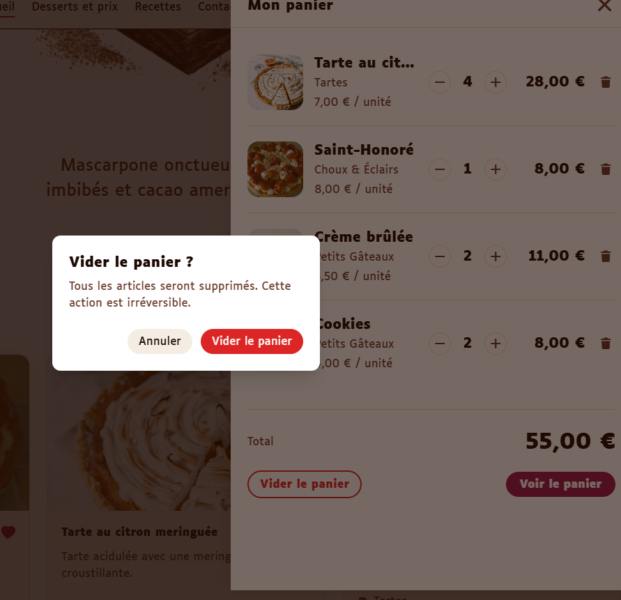

**Navigation intelligente**

La molécule NavigationLinks généré automatiquement les liens de navigation a partir de la route courante. Grace a la méthode `mount()`, elle detecte la page active et applique `aria-current="page"` sur le lien correspondant, sans configuration manuelle.

### 8.4 Les organismes -- les sections complètes de l'interface

#### Qu'est-ce qu'un organisme ?

Un organisme est le niveau le plus eleve de composition avant la page elle-meme. Il regroupe plusieurs molécules et atomes pour former une section complète et autonome de l'interface.

#### Les organismes créés

J'ai developpe **13 organismes** au total :

| Organisme        | Rôle                                                          |
|------------------|---------------------------------------------------------------|
| Header           | En-tete du site avec navigation et menu mobile                 |
| Footer           | Pied de page avec liens, mentions et reseaux                   |
| Form             | Formulaire de base réutilisable                                |
| LoginForm        | Formulaire de connexion complet                                |
| RegisterForm     | Formulaire d'inscription complet                               |
| AddressForm      | Formulaire d'adresse de livraison                              |
| ContactForm      | Formulaire de contact avec protection CSRF                     |
| PanierLive       | Panier interactif en temps reel (Live Component)               |
| ProductCardGrid  | Grille responsive de cartes produits/recettes                  |
| DessertCard      | Carte produit ou recette avec zoom, favoris, BoutonPanier      |
| BoutonPanier     | Bouton ajout panier avec contrôle quantite (Live Component)    |
| AvisForm         | Formulaire de depot d'avis avec selecteur d'etoiles            |
| AvisSection      | Section avis clients (liste + note moyenne + formulaire)       |

#### Conception des organismes

**Le Header : navigation responsive**

Le Header est un organisme sticky qui reste visible en haut de page lors du defilement. Sur mobile, un bouton hamburger ouvre un menu plein ecran via un élément `<dialog>` natif. Le basculement est géré par un contrôleur Stimulus `nav-toggle`.


**Les formulaires : une architecture en couches**

Les formulaires de SamyDessert sont construits en trois couches :

1. **Form** : l'organisme de base qui généré la balise `<form>` avec les attributs d'accessibilité, la méthode HTTP validée, et un `<fieldset>` optionnel.
2. **LoginForm, RegisterForm, AddressForm** : des organismes specialises qui composent Form avec les molécules de champs appropriees.
3. **Les molécules de champ** : chaque champ individuel avec son label, son aide et sa validation.

Tous les formulaires intégrént un token CSRF, une protection contre la double soumission via le contrôleur Stimulus `submit-once`, et un resume d'erreurs en haut du formulaire.

**Le PanierLive : un panier en temps reel**

Le PanierLive est l'organisme le plus interactif du projet. Implemente en tant que **Symfony UX Live Component**, il s'alimente automatiquement depuis le service de panier stocké en session. Il expose quatre actions live : `ajouter`, `retirer`, `supprimer`, `vider`. Chaque action emet un événement `panierUpdated` pour synchroniser le compteur dans le header.

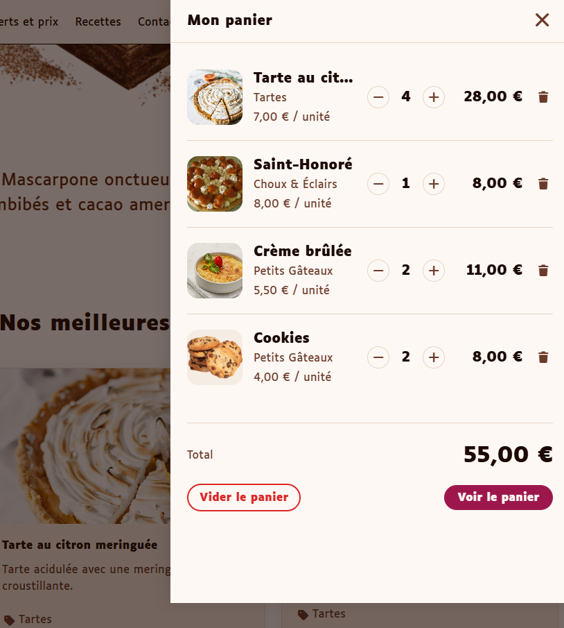

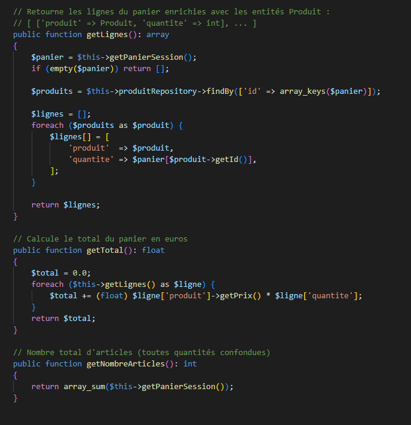

**La DessertCard : un organisme a double usage**

La DessertCard est le composant central de l'affichage des produits et des recettes. Elle fonctionne en deux modes selon les données qu'elle recoit :

- **Mode produit** : affiché le prix, le BoutonPanier (organisme Live Component) et un lien vers la fiche produit.
- **Mode recette** : affiché la difficulté (via un Badge colore), le temps, les portions, la catégorie et un lien vers la recette.

La carte intégré un zoom d'image via un élément `<dialog>` natif, et un système de favoris avec un bouton coeur animé via le contrôleur Stimulus `favori`.

```php
public string $titre = '';
public ?string $prix = null;       // → mode produit
public string $difficulté = '';     // → mode recette
public ?int $produitId = null;      // → active le BoutonPanier
public bool $favori = false;        // → état du favori
```

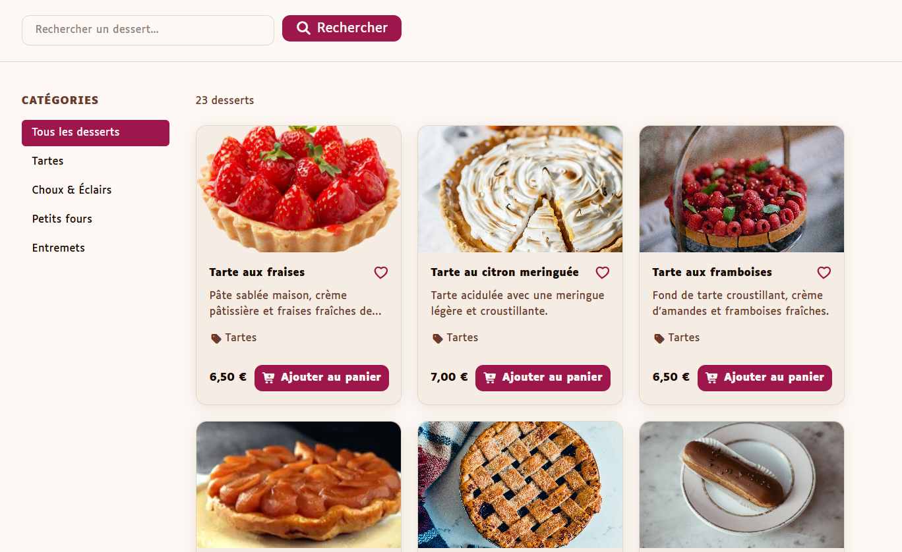

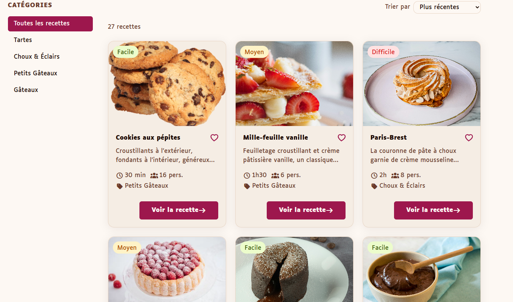

**Le BoutonPanier : un Live Component reactif**

Le BoutonPanier est un **Symfony UX Live Component** qui permet d'ajouter un produit au panier et d'ajuster la quantite directement depuis la carte, sans rechargément. Lorsque l'utilisateur clique sur "Ajoutér au panier", le bouton se transforme en contrôleur de quantite. La quantite est lue depuis le service de panier en session. A chaque modification, un événement `panierUpdated` est emis pour mettre a jour le compteur dans le header.

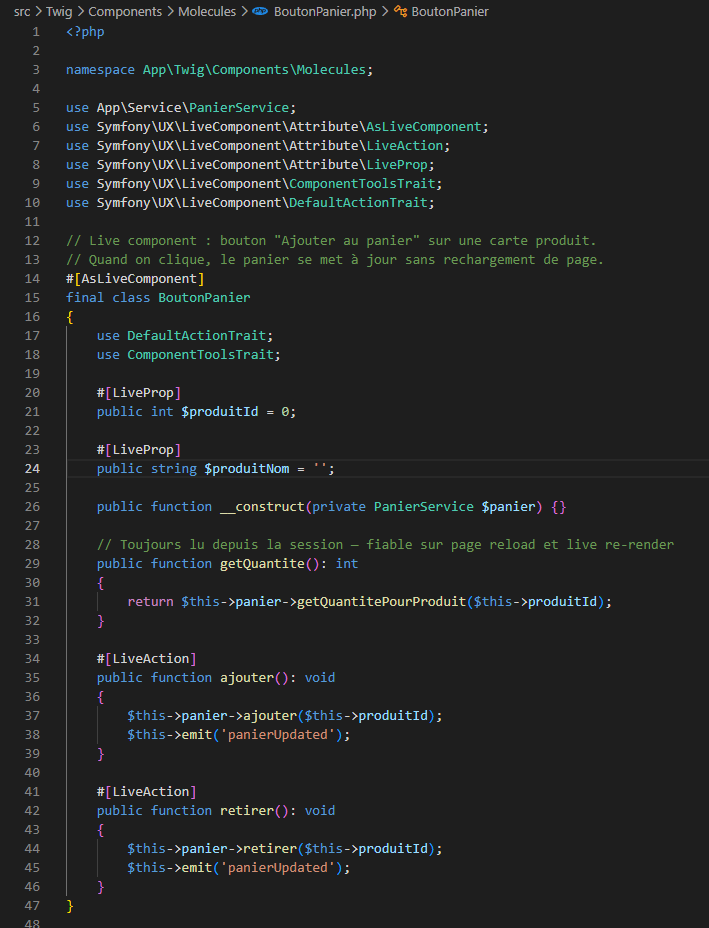

**L'AvisSection : section avis clients complète**

L'AvisSection est un organisme qui reunit l'ensemble du système d'avis : l'affichage de la note moyenne, la liste des AvisCard, et le formulaire de depot via AvisForm. Elle utilisé un Turbo Frame `avis` pour mettre a jour uniquement la section apres soumission, sans rechargément de page. La logique de récupération des données est gérée via `mount()`.

**La ProductCardGrid : grille responsive**

La ProductCardGrid affiché une collection de DessertCard dans une grille responsive (1 colonne mobile, 2 tablette, 3 desktop). La normalisation des données (URLs, images via VichUploader, prix) est traitee dans la méthode `mount()` PHP, ce qui garde le template Twig minimal.

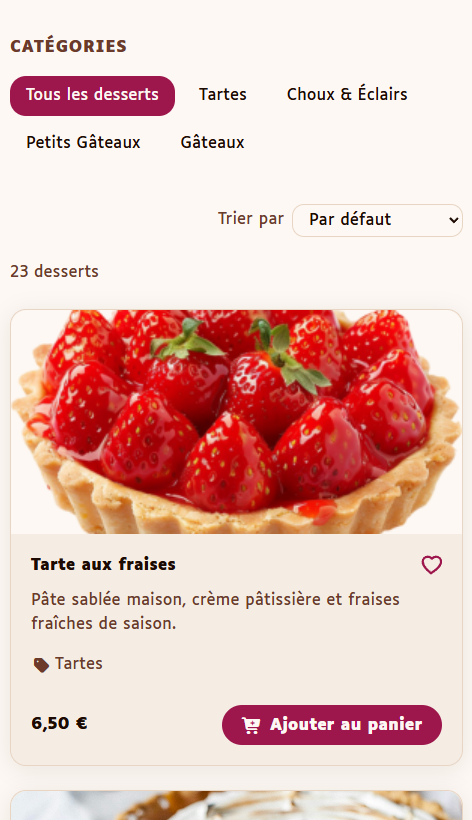

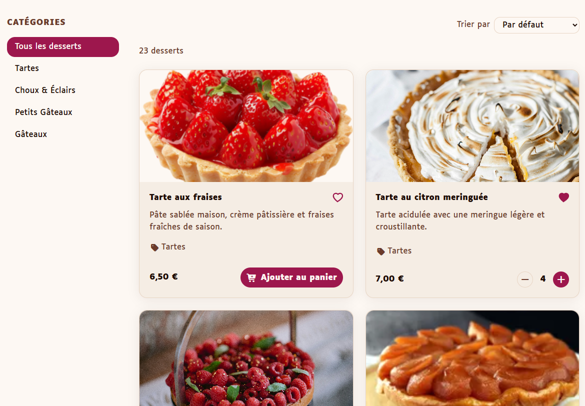

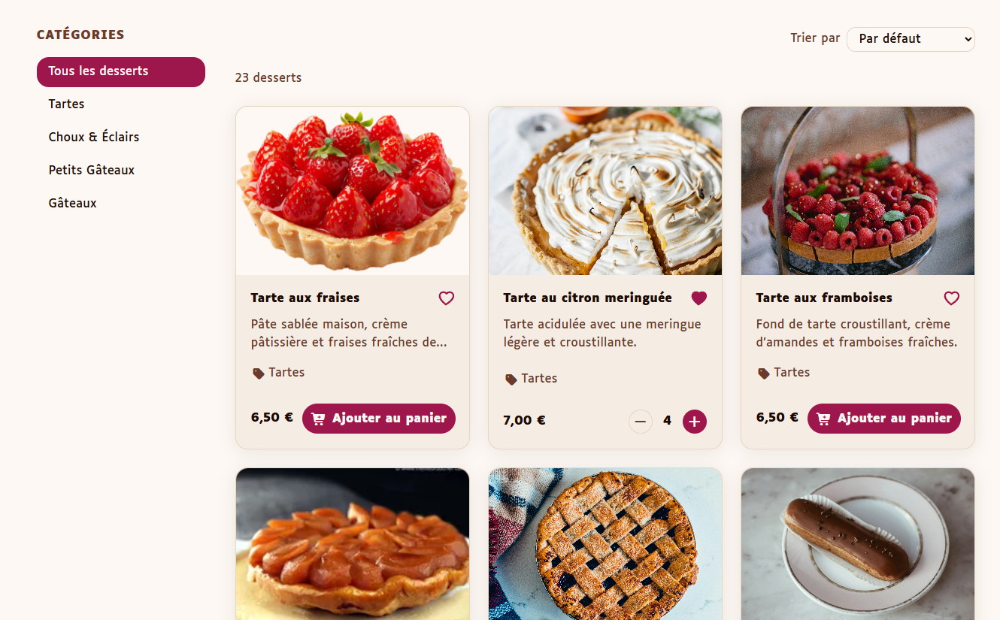

### 8.5 Le carousel

Le carousel de la page d'accueil est l'un des éléments les plus visibles du projet. Il affiché les produits phares en mode infini avec un effet de zoom sur la carte centrale et des animations de description directionnelles.


Il est construit en JavaScript vanilla (classe `Carousel` autonome, sans bibliothèque externe), inspiré d'un tutoriel **Grafikart** et étendu avec plusieurs fonctionnalités :

- **Mode infini** par clonage des premiers et derniers éléments
- **Effet zoom** sur la carte centrale via une classe CSS
- **Animations directionnelles** sur les descriptions (le texte glisse dans le sens du défilement)
- **Responsive** : 3 slides visibles sur desktop, 1 sur mobile
- **Accessibilité** : attributs ARIA mis à jour à chaque déplacement, navigation clavier (flèches)
- **Protection double-clic** via le drapeau `isAnimating`

Le controller Stimulus `carousel` instancie la classe `Carousel` et gère son cycle de vie (connexion / déconnexion).

Le carousel est le seul composant qui utilise la convention **BEM** (`carousel__item`, `carousel__next`…), car le JavaScript génère et manipule les classes du DOM dynamiquement — la hiérarchie BEM rend les relations entre éléments explicites sans ouvrir le CSS.

---

### 8.6 Les controllers Stimulus -- interactions côté client

#### Qu'est-ce que Stimulus ?

Stimulus est un framework JavaScript leger developpe par l'equipe de Basecamp. Contrairement a React ou Vue, il ne prend pas en chargé le rendu HTML : il se contente d'ajouter du comportement a un HTML deja present dans la page. Chaque controller est associé a un élément HTML via l'attribut `data-controller`.

Dans SamyDessert, Stimulus est initialise via `stimulus_bootstrap.js`, qui enregistre manuellement chaque controller aupres de l'application.

#### Les controllers créés

J'ai developpe **10 controllers** au total :

| Controller           | Rôle                                                                 |
|----------------------|----------------------------------------------------------------------|
| `annulation`         | Boite de dialogue de confirmation d'annulation de commande           |
| `carousel`           | Carousel infini avec zoom, transitions et accessibilité              |
| `cart-sidebar`       | Panneau lateral du panier (ouverture/fermeture avec transition)      |
| `consent-banner`     | Bandeau de consentement cookies (RGPD)                               |
| `csrf-protection`    | Génération du token CSRF dans les formulaires                        |
| `dropdown`           | Menu deroulant (profil utilisateur) avec fermeture au clic exterieur |
| `favori`             | Toggle favori sur les cartes produits (requête AJAX + mise a jour UI)|
| `flash-tooltip`      | Affichage temporaire d'un message de confirmation                    |
| `nav-toggle`         | Menu mobile (ouverture/fermeture de la navigation hamburger)         |
| `submit-once`        | Protection contre la double soumission de formulaire                 |

#### Exemples détailles

**`carousel` — carousel infini avec zoom, transitions et accessibilité**

Le carousel est le controller le plus complexe du projet. Il est construit autour d'une classe `Carousel` autonome (pure JS, sans dependance externe), instanciee par un controller Stimulus qui géré le cycle de vie du composant.

La base du carousel s'appuie sur le tutoriel de **Grafikart** (YouTube/grafikart.fr) consacre a la création d'un carousel en JavaScript vanilla. J'ai ensuite etendu cette base avec plusieurs fonctionnalités supplementaires : l'effet de zoom sur la carte centrale, les animations de description directionnelles, la gestion de l'accessibilité ARIA, l'adaptation responsive mobile/desktop et la protection contre le double-clic via `isAnimating`.

Le carousel est le seul composant du projet a utiliser la convention de nommage **BEM** (`carousel__item`, `carousel__next`, `carousel__prev`…). Ce choix est delibere : le JS généré les éléments du DOM dynamiquement via `createDivWithClass()` et manipule les classes au runtime. Dans ce contexte, la hierarchie BEM rend les relations entre éléments explicites directement dans le code JavaScript, sans avoir a ouvrir le CSS. Pour tous les autres composants, Tailwind CSS suffit et l'ajout de BEM aurait été redondant.

```js
// assets/controllers/carousel_controller.js — lignes 417-431
export default class extends Controller {
  connect() {
    this.carousel = new Carousel(this.élément, {
      slidesVisible: 3,
      slidesToScroll: 1,
      infinite: true,
      transitionDuration: 800,
    })
  }
  disconnect() {
    this.carousel.destroy()
  }
}
```


**Mode infini par clonage**

Pour simuler un carousel sans fin, les premiers et derniers éléments sont clones et inseres en debut/fin du conteneur. Quand la transition se termine, un repositionnement silencieux (`animation = false`) remet le curseur sur les vrais éléments — l'utilisateur ne voit pas le saut.

```js
// lignes 58-68 : construction de la liste avec clones
this.offset = this.options.slidesVisible + this.options.slidesToScroll;
this.items = [
  ...this.items.slice(this.items.length - this.offset).map(item => item.cloneNode(true)),
  ...this.items,
  ...this.items.slice(0, this.offset).map(item => item.cloneNode(true)),
];

// lignes 355-361 : repositionnement silencieux apres transition
resetInfinite() {
  if (this.currentItem <= this.options.slidesToScroll) {
    this.gotoItem(this.currentItem + this.items.length - 2 * this.offset, false);
  } else if (this.currentItem >= this.items.length - this.offset) {
    this.gotoItem(this.currentItem - (this.items.length - 2 * this.offset), false);
  }
}
```


**Responsive : adaptation mobile/desktop**

Deux getters retournent des valeurs differentes selon le contexte. A la connexion et a chaque resize, `onWindowResize` detecte le changement et recale la carte active pour qu'elle reste visible.

```js
// lignes 403-409
get slidesToScroll() { return this.isMobile ? 1 : this.options.slidesToScroll; }
get slidesVisible()  { return this.isMobile ? 1 : this.options.slidesVisible; }
```

**Effet zoom et animation des descriptions**

La carte centrale recoit la classe `carousel__item--zoom` (scale CSS). Quand le carousel avance, le texte de la carte sortante glisse dans la direction du mouvement et disparait ; le texte de la carte entrante arrive depuis le cote oppose. Un reflow force (`desc.offsetHeight`) est nécessaire pour que la transition CSS se declenche apres la remise a zero de la position.

```js
// lignes 289-306 : animation d'entree du texte
showDescription(item, animate = true, direction = 1) {
  const desc = item.querySelector(".carousel-card-description");
  if (!desc) return;
  desc.style.transition = "none";
  desc.style.opacity = "0";
  desc.style.transform = `translateX(${direction * 30}px)`;
  desc.offsetHeight; // force le reflow
  desc.style.transition = "opacity 0.5s ease, transform 0.5s ease";
  desc.style.opacity = "1";
  desc.style.transform = "translateX(0)";
}
```

**Protection contre le double-clic**

Le drapeau `isAnimating` est passe a `true` au debut de `next()`/`prev()` et remis a `false` a la fin de la transition (`transitionend`). Un `setTimeout` de secours evite un blocage si l'événement `transitionend` ne se declenche pas.

```js
// lignes 189-205
next() {
  if (this.isAnimating) return;
  this.isAnimating = true;
  this.gotoItem(this.currentItem + this.slidesToScroll);
  setTimeout(() => { this.isAnimating = false; }, this.options.transitionDuration);
}
```

**Accessibilité**

`updateAccessibility` met a jour les attributs ARIA a chaque deplacement : `aria-hidden`, `aria-current`, `tabindex` sur les cartes et leurs boutons internes. La navigation au clavier (fleches gauche/droite) est gérée par un ecouteur sur le conteneur racine. Un élément `aria-live="polite"` annonce le numero de slide courant aux technologies d'assistance.

**`favori` — requêtes AJAX et outlets Stimulus**

Le controller `favori` utilisé l'API `fetch` pour envoyér une requête POST sans rechargément de page. Il utilisé le mecanisme d'**outlets** de Stimulus pour communiquer avec le controller `flash-tooltip` voisin : si l'utilisateur n'est pas connecté (réponse HTTP 401), le message "Connectez-vous pour ajouter aux favoris" s'affiché automatiquement.

**`submit-once` — protection contre la double soumission**

Ce controller desactive le bouton de soumission des qu'un formulaire est envoyé. Il masque le libelle du bouton, affiché un spinner et ajouté `aria-busy="true"`. Cela evite les doubles commandes ou les doubles inscriptions dues a un double-clic.

**`annulation` — boite de dialogue native**

Ce controller géré la confirmation avant d'annuler une commande. Il utilisé l'élément HTML natif `<dialog>`, recupere la référence et l'URL d'action depuis les attributs `data-*` du bouton, et soumet un formulaire POST avec le token CSRF si l'utilisateur confirme.

### 8.6.2 Turbo et AJAX -- navigation rapide et mises à jour partielles

#### AJAX : mise a jour sans rechargément

AJAX (Asynchronous JavaScript And XML) est une technique qui permet d'envoyér ou de recevoir des données depuis le serveur **sans recharger toute la page**. Dans SamyDessert, AJAX est utilisé pour le système de favoris : quand l'utilisateur clique sur le coeur d'une carte produit, une requête `fetch` est envoyée en arriere-plan vers `/favori/{type}/{id}`. Le serveur repond en JSON `{ favori: true }` et le controller Stimulus met a jour l'interface immediatement, sans aucun rechargément visible.

```
Clic → fetch POST (AJAX) → Controller PHP → JSON → Stimulus met a jour le bouton
```

Sans AJAX, chaque clic sur "ajouter aux favoris" rechargerait toute la page — ce qui est lent et rompt l'expérience utilisateur.

#### Turbo Drive : navigation rapide

Turbo Drive (anciennement Turbolinks) intercepte tous les clics sur les liens et les soumissions de formulaires. Au lieu de laisser le navigateur faire un rechargément complet, il :

1. Recupere le HTML de la nouvelle page via `fetch`
2. Remplace uniquement le `<body>` (le `<head>` est conserve)
3. Met a jour l'URL dans la barre du navigateur

**Resultat :** la navigation entre pages est aussi rapide qu'une SPA (Single Page Application), mais sans ecrire de JavaScript — c'est automatique pour tous les liens du site.

#### Turbo Frames : mises à jour partielles

Un `<turbo-frame>` est une zone isolee de la page. Quand un lien ou un formulaire a l'interieur d'un frame est active, Turbo recupere la réponse du serveur et **ne remplace que cette zone**, pas toute la page.

Dans SamyDessert, les pages `/produits` et `/recettes` utilisént un `<turbo-frame>` pour le filtrage par catégorie. Quand l'utilisateur clique sur "Tartes", seule la grille de cartes est mise a jour — le header, le footer et la sidebar restent en place.

```html
<turbo-frame id="produits-results" target="_top">
  <!-- Seul ce bloc est remplace lors du filtrage -->
</turbo-frame>
```

L'attribut `target="_top"` indique que les liens vers les fiches produits (qui sont a l'interieur du frame) doivent faire une navigation complète, et non une mise a jour du frame. Les liens de filtrage gardent `data-turbo-frame="produits-results"` qui override ce comportement et ciblent bien le frame.

#### Stimulus + Turbo + AJAX : trois outils complémentaires

| Outil | Rôle | Exemple dans le projet |
|-------|------|----------------------|
| **AJAX (fetch)** | Requete serveur sans rechargément, réponse JSON | Toggle favori |
| **Turbo Drive** | Navigation entre pages sans rechargément complet | Tous les liens du site |
| **Turbo Frame** | Mise a jour d'une zone precise de la page | Filtrage produits/recettes |
| **Stimulus** | Comportement JS attache au HTML existant | Carousel, menu mobile, favoris |

Ces trois outils permettent d'avoir un site interactif et rapide **sans ecrire de framework front-end** (pas de React, pas de Vue), en gardant le rendu HTML côté serveur (Symfony + Twig).

---

### 8.7 Architecture CSS -- Tailwind v4 et design tokens

#### Un seul fichier d'entree

Tout le CSS du projet est centralise dans un seul fichier : `assets/styles/app.css`. Il n'y a pas de `tailwind.config.js` : Tailwind v4 fonctionne entierement via des directives CSS.

```css
@import "tailwindcss";
@source "../../templates/**/*.twig";
@source "../../assets/**/*.js";
```

#### Les tokens de design (@theme)

La directive `@theme` définit l'ensemble des tokens du projet. Tailwind généré automatiquement les classes utilitaires (`bg-*`, `text-*`, `border-*`, etc.) a partir de ces variables.

| Token              | Usage                              |
|--------------------|-------------------------------------|
| `primary`          | Couleur de marque principale (chocolat) |
| `accent`           | CTA, prix, éléments forts (framboise)   |
| `succèss`          | Statuts positifs (pistache)         |
| `warning`          | En attente, difficulté moyenne (ambre) |
| `danger`           | Erreurs, annulations (rouge)        |

Les tokens d'espacement utilisént `clamp()` pour s'adapter automatiquement a la largeur de l'ecran :

```css
--spacing-side: clamp(1rem, 15vw, 50rem);
--spacing-top:  clamp(1rem, 5vh, 5rem);
```

#### Les classes utilitaires (@layer components)

Des classes recurrentes sont définies dans `@layer components` : `.btn-cta`, `.btn-cta-sm`, `.btn-cta-outline`, `.page-title`, `.section-title`, `.container-main`, `.card`.

#### La police Luciole

La police **Luciole** est chargée localement avec `font-display: swap`, en formats `.woff2` et `.woff`. Elle est conçue pour les personnes malvoyantes ou dyslexiques.

---

---

## 9. Conception de la base de données

---

La base de données repose sur **MySQL** et est gérée via **Doctrine ORM**. Elle contient sept entités principales.

### Les entités

**Utilisateur**
Represente un compte client. Stocke l'email (identifiant unique), le mot de passe hache, les informations personnelles (nom, prenom, telephone, adresse) et les rôles Symfony. Deux champs specifiques gérént la vérification d'email : `isVerified` (booleen) et `vérificationToken` (token a usage unique supprime apres validation). Un utilisateur peut avoir plusieurs commandes et plusieurs produits en favoris.

**Produit**
Represente un dessert vendu sur le site. Contient le nom, la description, le prix (stocké en DECIMAL pour eviter les erreurs d'arrondi), le nom du fichier image (géré par VichUploaderBundle), un indicateur de disponibilite, un slug SEO-friendly et la date d'ajout. Un produit appartient a une catégorie et peut etre associé a une recette.

**Catégorie**
Regroupe les produits et les recettes par type (ex : Tartes, Choux, Petits fours). Possede un nom et un slug unique.

**Recette**
Represente une recette publiée sur le site. Contient le titre, la description, le contenu complet, le nom du fichier image, la duree en minutes, le niveau de difficulté (via un enum PHP), le nombre de portions et un slug. Une recette peut etre liée a un produit.

**Commande**
Represente une commande passee par un utilisateur. Contient la date, le statut (via un enum PHP : `EnAttente`, `Confirmee`, `Livree`, `Annulee`), le total, l'adresse de livraison et une référence lisible (ex : `CMD-2026-00042`). Une commande est liée a un utilisateur et contient plusieurs lignes de commande.

**CommandeProduit**
Table de jointure entre `Commande` et `Produit`. Constitue la ligne de commande : elle stocké la quantite et le **prix unitaire au moment de la commande** (snapshot), independamment du prix actuel du produit. La clé primaire est composite (commande + produit).

**Avis**
Represente un avis laisse par un utilisateur sur un produit. Contient une note (1 a 5), un commentaire optionnel et un indicateur de validation. Un utilisateur ne peut laisser qu'un seul avis par produit (contrainte unique en base).

### Relations

```
Utilisateur  ──< Commande        (1 utilisateur → plusieurs commandes)
Commande     ──< CommandeProduit (1 commande → plusieurs lignes)
Produit      ──< CommandeProduit (1 produit → plusieurs lignes de commande)
Catégorie    ──< Produit         (1 catégorie → plusieurs produits)
Catégorie    ──< Recette         (1 catégorie → plusieurs recettes)
Produit      ──1 Recette         (1 produit → une recette liée, optionnelle)
Utilisateur  >──< Produit        (favoris — relation ManyToMany)
```

### Choix techniques notables

Le prix est stocké en `DECIMAL(8,2)` plutot qu'en `FLOAT` pour eviter les erreurs d'arrondi sur les calculs financiers. Le prix unitaire est duplique dans `CommandeProduit` pour conserver un historique fiable, independamment des modifications futures du catalogue. Les enums PHP natifs (`StatutCommande`, `Difficulté`) sont utilisés pour les colonnes a valeurs contrôlees, ce qui garantit l'integrite des données au niveau du code.

Les images produits et recettes sont gérées par **VichUploaderBundle** : le fichier physique est stocké dans `public/uploads/produits/` ou `public/uploads/recettes/`, et seul le nom du fichier est enregistre en base de données. Cette approche evite de stocker des données binaires en base.

#### Ajout des images en pratique

Les images du catalogue ont été preparees manuellement puis intégrées de deux facons selon le contexte :

**Via l'interface d'administration (EasyAdmin)** : pour chaque produit ou recette, un champ upload est disponible dans le formulaire d'edition. L'administrateur selectionne une image depuis son poste, VichUploaderBundle la renomme automatiquement (via `SmartUniqueNamer`) pour eviter les conflits, et la depose dans le bon dossier (`public/uploads/produits/` ou `public/uploads/recettes/`). Seul le nom du fichier resultant est enregistre en base.

**Via les fixtures de développement** : les images preparees (photos libres de droits provenant d'**Unsplash**, au format JPG, PNG ou WebP) ont été deposees directement dans `public/uploads/produits/` et `public/uploads/recettes/`, puis leur nom de fichier a été renseigne dans les fixtures PHP (`AppFixtures`). Cette méthode permet de charger rapidement un jeu de données complet avec des visuels realistes sans passer par l'interface d'administration.

Dans les deux cas, le template Twig utilisé la fonction `vich_uploader_asset(produit, 'imageFile')` pour générer l'URL publique de l'image a partir du nom de fichier stocké en base.

### Schema relationnel

Afin de mieux visualiser la structure des données du projet, un schema relationnel a été réalisé avec l'outil DBDiagram.

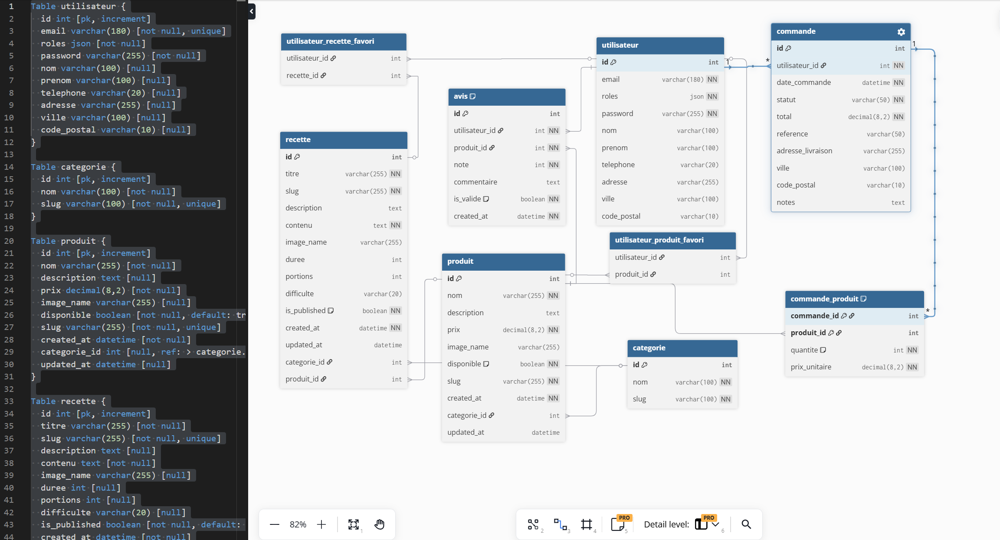

Ce schema met en evidence les differentes entités du projet ainsi que leurs relations :

- un utilisateur peut posseder plusieurs commandes
- une commande est composee de plusieurs lignes (CommandeProduit)
- un produit peut apparaitre dans plusieurs commandes
- une catégorie regroupe plusieurs produits et recettes
- un utilisateur peut ajouter des produits et des recettes en favoris
- un utilisateur peut laisser un avis (note + commentaire) par produit


---

## 10. Développement back-end

---

### 10.1 Controllers PHP

Le back-end est organise autour de **11 controllers** Symfony :

| Controller                | Route(s)                      | Rôle                                               |
|---------------------------|-------------------------------|----------------------------------------------------|
| `HomeController`          | `/`                           | Page d'accueil avec produits phares et carousel    |
| `ProduitsController`      | `/produits`, `/produits/{slug}` | Liste et fiche produit, filtrés et recherche     |
| `RecettesController`      | `/recettes`, `/recettes/{slug}` | Liste et fiche recette, filtrés et recherche     |
| `PanierController`        | `/panier`                     | Affichage et gestion du panier en session          |
| `CommandeController`      | `/commande/*`                 | Tunnel de commande en 3 étapes + Stripe            |
| `CompteController`        | `/mon-compte/*`               | Espace client : profil, commandes, favoris         |
| `SecurityController`      | `/connexion`, `/inscription`  | Authentification, inscription, vérification email  |
| `ContactController`       | `/contact`                    | Formulaire de contact avec envoi d'email           |
| `FavoriController`        | `/favori/{type}/{id}`         | Toggle favori en AJAX (produits et recettes)       |
| `AvisController`          | `/produits/{slug}/avis`       | Soumission d'un avis note + commentaire            |
| `MentionsLegalesController` | `/mentions-legales`         | Page statique des mentions legales                 |

**CommandeController**

C'est le controller le plus complexe. Il géré le tunnel de commande en trois étapes sequentielles :

1. **`/commande/adresse`** : validation et stockage de l'adresse de livraison en session.
2. **`/commande`** : affichage du récapitulatif depuis le panier et la session.
3. **`/commande/paiement`** : création d'une session Stripe Checkout et redirection.

Apres le paiement, Stripe redirige vers `/commande/succès` ou le controller enregistre la commande, vide le panier et envoie l'email de confirmation.

**FavoriController**

Appele exclusivement en AJAX. Il vérifié que l'utilisateur est connecté (renvoie un 401 sinon), validé que la requête est bien AJAX, bascule l'état favori, puis renvoie un JSON `{ favori: true|false }`.

**AvisController**

Accessible uniquement aux utilisateurs connectés (`#[IsGranted('ROLE_USER')]`). Validé le token CSRF, vérifié que la note est comprise entre 1 et 5, puis créé ou met a jour l'avis de l'utilisateur sur le produit (un seul avis par couple utilisateur/produit, grace a la contrainte unique en base). L'avis est marque comme validé (`isValidé = true`) directement a la soumission. La note moyenne et la liste des avis sont calcules par `AvisRepository` et affichés sur la fiche produit.

### 10.2 Services

**`PanierService`**
Gere le panier stocké en session PHP. La structure en session est un tableau associatif `[produitId => quantite]`. En isolant cette logique dans un service, plusieurs controllers et le Live Component PanierLive peuvent l'utiliser sans dupliquer le code.

**`MailerService`**
Centralise tous les emails transactionnels. Il expose trois méthodes : `envoyérConfirmationInscription()`, `envoyérConfirmationCommande()` et `envoyérMessageContact()`.

**`FactureService`**
Genere les factures PDF associées aux commandes confirmees, jointes en piece jointe a l'email de confirmation.

---

### 10.3 Le reste de src/

#### Exemple d'entité PHP

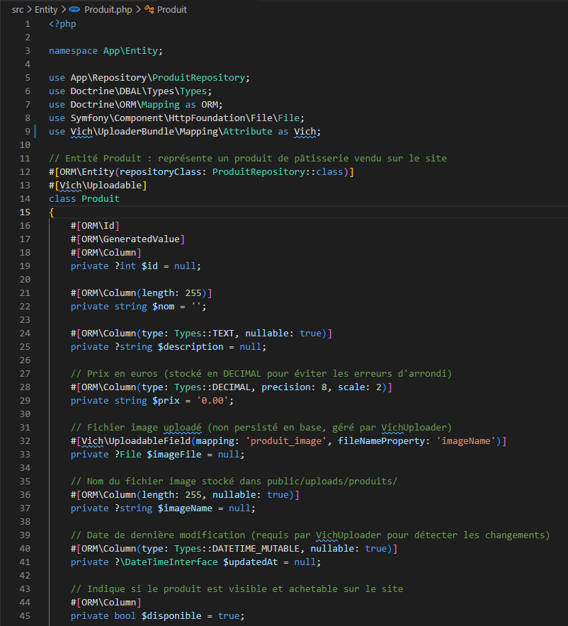

#### Les enums PHP

Le projet utilisé deux **enums PHP natifs** (PHP 8.1+) :

`StatutCommande` : `EnAttente`, `Confirmee`, `Livree`, `Annulee`.
`Difficulté` : `Facile`, `Moyen`, `Difficile`.

Ces enums de type `string` permettent a Doctrine de les stocker directement en base et garantissent que seules les valeurs prevues peuvent etre assignees.

```php
enum StatutCommande: string {
    case EnAttente  = 'en_attente';
    case Confirmee  = 'confirmee';
    case Livree     = 'livree';
    case Annulee    = 'annulee';
}
```

#### Les repositories Doctrine

Le `ProduitRepository` contient la requête personnalisée la plus notable : `findMeilleursVendus()`. Elle utilisé le Query Builder pour trier les produits par quantite totale commandee, avec fallback sur les plus récents si aucune commande n'existe.

```php
$this->createQueryBuilder('p')
    ->leftJoin(CommandeProduit::class, 'cp', 'WITH', 'cp.produit = p')
    ->andWhere('p.disponible = true')
    ->groupBy('p.id')
    ->orderBy('SUM(cp.quantite)', 'DESC')
    ->setMaxResults($limit)
```

#### Les extensions Twig

**`PrixExtension`** : filtré `|prix` pour formater les montants en euros selon les conventions francaises.

```twig
{{ produit.prix|prix }}  {# → "12,50 €" #}
```

**`PanierExtension`** : injecte la variable globale `panierCount` dans tous les templates Twig sans que les controllers aient besoin de la passer manuellement.

#### La classe UserChecker

Bloque la connexion si le compte n'a pas encore été vérifié par email. Si `isVerified` est `false`, une exception contrôlee est levee avec un message explicite.

#### Les fixtures

`AppFixtures` peuple la base de données avec des données realistes pour le développement (catégories, produits, recettes). Executees avec :

```bash
php bin/console doctrine:fixtures:load
```

---

## 11. Accessibilité

---

L'accessibilité est intégrée des la conception du projet, pas ajoutée en fin de développement. Chaque composant est conçu pour etre utilisable sans souris, lisible par un lecteur d'ecran et visible dans des conditions de faible vision.

### 11.1 Typographie Luciole

La police **Luciole** a été conçue specifiquement pour les personnes malvoyantes ou dyslexiques. Ses caractéristiques : hauteur d'x elevee (les lettres minuscules sont plus grandes), formes de lettres tres distinctes (le `1`, le `l` et le `I` ne se ressemblent pas), espacement généréux entre les caracteres. Elle est reconnue par des associations comme Valentin Hauy et disponible sous licence libre (SIL OFL).

### 11.2 Contrastes de couleurs

La palette a été construite en verifiant systematiquement les ratios de contraste selon les criteres **WCAG 2.1 AA** (4.5:1 minimum pour le texte courant, 3:1 pour les grands titres et éléments graphiques).

| Combinaison | Ratio | WCAG AA |
|-------------|-------|---------|
| Texte principal sur fond (--color-text sur --color-bg) | ~14:1 | ✅ |
| Texte secondaire sur fond (--color-text-light sur --color-bg) | ~7:1 | ✅ |
| Texte blanc sur framboise (--color-white sur --color-accent) | ~5.2:1 | ✅ |
| Texte framboise sur fond (--color-accent sur --color-bg) | ~4.6:1 | ✅ |
| Badge texte sur fond badge | ~4.8:1 | ✅ |

Outils utilisés : **Colorable**, **Adobe Color**, **DevTools Chrome** (onglet Accessibility).


### 11.3 Navigation clavier

Tous les éléments interactifs sont accessibles au clavier : boutons, liens, champs, cases a cocher, boites de dialogue. La regle Tailwind `focus-visible:outline` affiché le contour uniquement lors de la navigation clavier, pas lors d'un clic souris — ce qui est a la fois propre visuellement et conforme WCAG.

Les boites de dialogue `<dialog>` (confirmation de vidage du panier) gérént nativement le **piegeage du focus** : la touche Tab ne sort pas de la modale tant qu'elle est ouverte. La touche Echap ferme la boite de dialogue.

### 11.4 Attributs ARIA et HTML sémantique

| Attribut | Ou il est utilisé |
|----------|-------------------|
| `aria-label` | Boutons sans texte visible (icone panier, icone poubelle) |
| `aria-current="page"` | Lien actif dans la navigation |
| `aria-invalid="true"` | Champ en erreur apres soumission d'un formulaire |
| `aria-describedby` | Relie un champ a son message d'aide ou d'erreur |
| `aria-live="polite"` | Zone mise a jour dynamiquement (compteur panier) |
| `aria-hidden="true"` | Icones purement decoratives |
| `aria-expanded` | Bouton burger du menu mobile |
| `aria-controls` | Relie le bouton burger a la zone qu'il ouvre |
| `aria-busy="true"` | Bouton de soumission pendant le chargément |
| `rôle="dialog"` + `aria-modal` | Boite de dialogue de confirmation |

Structure HTML sémantique : `<main>`, `<header>`, `<footer>`, `<nav>`, `<section>`, `<article>`, `<dialog>`. La hierarchie des titres (h1 → h2 → h3) est respectee sur toutes les pages.

### 11.5 Outils d'accessibilité utilisés

- **Colorable** — vérification des ratios de contraste
- **Adobe Color** — outil de daltonisme (simulation des 8 types de daltonisme)
- **BlooAI** — audit automatise d'accessibilité
- **userpersona.dev** — création de personas incluant des profils avec handicaps
- **DevTools Chrome** — onglet Accessibility Tree pour vérifier la structure lue par les lecteurs d'ecran

---

## 12. Sécurité

---

### 12.1 Authentification et gestion des utilisateurs

La sécurité est configuree dans `security.yaml`.

 Les mots de passe sont haches avec l'algorithme moderne de Symfony (`'auto'`). L'identifiant de connexion est l'adresse e-mail.

```yaml
firewalls:
    main:
        lazy: true
        provider: app_user_provider
        user_checker: App\Security\UserChecker
```

Le message d'erreur en cas d'echec de connexion est volontairement vague : "Adresse email ou mot de passe incorrect." Il ne precise pas lequel des deux est faux. C'est un choix de sécurité delibere : si le message indiquait "email inconnu", un attaquant pourrait enumerer les comptes existants ; s'il indiquait "mot de passe incorrect", il saurait que l'email est validé et pourrait cibler ses tentatives. Le message ambigu protégé contre ces deux vecteurs d'attaque.

### 12.2 Inscription et vérification d'e-mail

Lors de l'inscription, le mot de passe est hache et un jeton de vérification est généré de maniere securisee :

```php
$token = bin2hex(random_bytes(32));
```

Ce jeton est envoyé dans un lien de confirmation. Une fois validé, le compte est active et le jeton est supprime pour qu'il ne puisse pas etre reutilisé.

### 12.3 Contrôle de l'état du compte

La classe `UserChecker` personnalisée bloque la connexion si le compte n'a pas été vérifié par email, en levant une `CustomUserMessageAccountStatusException` avec un message explicite.

### 12.4 Protection des formulaires et des actions sensibles

Tous les formulaires intégrént un token CSRF. L'annulation de commande vérifié le token avant toute action. Les interactions AJAX (favoris) vérifiént que l'utilisateur est connecté et que les parametres sont validés.

### 12.5 Sécurisation de l'espace client

Le `CompteController` est protégé par `#[IsGranted('ROLE_USER')]`. Les commandes affichées sont filtrées pour n'appartenir qu'a l'utilisateur connecté. L'annulation vérifié que la commande ciblee appartient bien a l'utilisateur avant toute action.

### 12.6 Paiement en ligne avec Stripe

Le tunnel de commande comprend trois étapes : adresse, récapitulatif, paiement Stripe. Le montant est reconstruit côté serveur a partir du panier, sans faire confiance a un montant transmis par le navigateur. La clé secrete Stripe est utilisée côté serveur uniquement, via les variables d'environnement.

*Limite connue : la confirmation de commande repose sur l'arrivee de l'utilisateur sur la page succès. Une solution plus robuste utiliserait un webhook Stripe.*

### 12.7 Gestion des secrets et configuration

Les informations sensibles (DATABASE_URL, STRIPE_SECRET_KEY, MAILER_DSN) sont stockées dans `.env.local`, exclu du versioning git.

### 12.8 Limites actuelles et améliorations possibles

- Utilisér davantage les formulaires Symfony avec validation intégrée
- Renforcer les contraintes sur les mots de passe
- Ajoutér une expiration pour les jetons de vérification
- Ameliorer la protection du formulaire de contact (token CSRF, anti-spam)
- Fiabiliser le tunnel de paiement avec un webhook Stripe

---

## 13. Tests

---

### Tests fonctionnels manuels

Chaque fonctionnalité a été testee directement dans le navigateur :

- Inscription avec vérification d'email (token de confirmation)
- Connexion avec un compte vérifié et tentative avec un compte non vérifié
- Ajout et suppression de produits dans le panier depuis la fiche produit et le catalogue
- Passage de commande complet : saisie d'adresse → récapitulatif → paiement Stripe (mode test)
- Annulation d'une commande depuis l'espace client
- Gestion des favoris (ajout, suppression, persistance apres rechargément)
- Formulaire de contact
- Navigation clavier sur l'ensemble des pages

### Scenario de test -- parcours complet utilisateur

**Objectif** : vérifier qu'un utilisateur peut consulter les produits, ajouter un articlé au panier, passer commande et obtenir une confirmation apres paiement.

**Preconditions**
- L'utilisateur possede un compte créé et vérifié par e-mail
- Au moins un produit est disponible dans le catalogue
- Le mode test Stripe est configure

**Étapes**

1. **Acces au site** : l'utilisateur arrive sur la page d'accueil et consulte les produits mis en avant.
2. **Consultation du catalogue** : il accede a la page des produits et ouvre la fiche d'un produit.
3. **Ajout au panier** : il ajouté un articlé au panier. Le compteur du panier est mis a jour visuellement.
4. **Consultation du panier** : il ouvre le panier, vérifié le contenu, ajuste la quantite si besoin.
5. **Saisie de l'adresse** : il renseigne les informations de livraison.
6. **Recapitulatif** : le site affiché un resume avec les produits, l'adresse et le total.
7. **Paiement** : l'utilisateur est redirige vers Stripe Checkout en mode test.
8. **Confirmation** : apres validation, la commande est enregistree, le panier est vide et une page de confirmation est affichée.

**Resultats attendus**
- Le produit est bien ajouté au panier
- Le total de commande est correct
- La redirection vers Stripe fonctionne
- La commande est enregistree apres paiement
- Le panier est vide apres confirmation

**Cas d'echec vérifiés**
- Tentative d'acces au paiement avec un panier vide
- Tentative d'acces au récapitulatif sans adresse enregistree
- Annulation Stripe avec retour sur le site sans perte du panier

### Tests d'accessibilité

La navigation au clavier a été vérifiée sur tous les composants interactifs. Les contrastes de couleur ont été contrôles avec Colorable. La structure HTML a été validée avec une checklist personnalisée.

### Tests responsives

L'interface a été vérifiée aux trois breakpoints (mobile, tablette, desktop) via les outils de développement du navigateur.

### Tests automatises

En complement des tests manuels, une suite de tests automatises a été mise en place avec **PHPUnit 12**, **Symfony WebTestCase** et **Zenstruck Foundry v2**.

#### Infrastructure de test

| Outil | Rôle |
|-------|------|
| PHPUnit 12 | Framework de test PHP |
| Symfony WebTestCase | Client HTTP simulant un navigateur pour les tests fonctionnels |
| Zenstruck Foundry v2 | Fabrication d'entités en base de données (fixtures de test) |
| FakerPHP | Génération de données realistes (emails, noms, prix...) |

Chaque test s'execute sur une base de données isolee (`samydessert_test`). Le trait `ResetDatabase` de Foundry reiitialise la base entre chaque test, garantissant l'independance des cas.

#### Factories de données

Deux factories ont été créées pour générer des entités de test sans effort :

- **`UtilisateurFactory`** : créé un utilisateur avec un email unique, un mot de passe hache (`motdepasse123`) et un compte vérifié par défaut.
- **`ProduitFactory`** : créé un produit avec un nom, un slug, un prix et une image générée par Faker.

```php
$user    = UtilisateurFactory::createOne(['email' => 'test@test.com']);
$produit = ProduitFactory::createOne(['prix' => '9.90']);
$client->loginUser($user);
```

#### Catégories de tests

**Tests unitaires** (sans base de données, sans requête HTTP) :

| Fichier | Ce qui est vérifié |
|---------|-------------------|
| `tests/Service/PanierServiceTest.php` | Ajout, retrait, suppression, vidage et calcul du total panier (9 tests) |
| `tests/Entity/CommandeTest.php` | Calcul du total d'une commande, ajout de lignes, statuts (8 tests) |
| `tests/Service/MailerServiceTest.php` | Envoi d'emails (confirmation commande, contact) via mailer mocke (5 tests) |
| `tests/Security/UserCheckerTest.php` | Blocage de connexion si compte non vérifié, message d'erreur (4 tests) |

**Tests fonctionnels** (requêtes HTTP sur le vrai noyau Symfony) :

| Fichier | Ce qui est vérifié |
|---------|-------------------|
| `tests/Controller/PagesTest.php` | Codes HTTP des pages publiques (200, 301, 404) — 11 tests |
| `tests/Controller/ContactControllerTest.php` | Affichage et soumission du formulaire de contact (2 tests) |
| `tests/Controller/ConnexionControllerTest.php` | Connexion validé, echec, redirection (3 tests) |
| `tests/Controller/InscriptionControllerTest.php` | Inscription validé, email deja utilisé, champs manquants (5 tests) |
| `tests/Controller/PanierControllerTest.php` | Ajout, retrait, vidage du panier via les routes POST (6 tests) |
| `tests/Controller/CommandeControllerTest.php` | Acces sans connexion, panier vide, saisie d'adresse, CSRF (9 tests) |
| `tests/Controller/CompteControllerTest.php` | Acces protégé, affichage de l'email (3 tests) |
| `tests/Controller/FavoriControllerTest.php` | Toggle favori (ajout/retrait), réponse JSON, auth requise (8 tests) |

#### Exemple : test du toggle favori

```php
public function testToggleProduitAjoutéFavori(): void
{
    $client  = static::createClient();
    $user    = UtilisateurFactory::createOne();
    $produit = ProduitFactory::createOne();
    $client->loginUser($user);

    $client->request('POST', '/favori/produit/' . $produit->getId(), [], [], [
        'HTTP_X-Requested-With' => 'XMLHttpRequest',
    ]);

    $this->assertResponseIsSuccessful();
    $data = json_decode($client->getResponse()->getContent(), true);
    $this->assertTrue($data['favori']); // premier toggle → ajout
}
```

#### Exemple : test CSRF sur le formulaire d'adresse

Pour les formulaires protégés par un token CSRF, le test recupere le token depuis la page rendue avant de soumettre :

```php
$crawler   = $client->request('GET', '/commande/adresse');
$csrfToken = $crawler->filter('input[name="_token"]')->attr('value');

$client->request('POST', '/commande/adresse', [
    'firstName' => 'Jean', 'lastName' => 'Dupont',
    'address1'  => '12 rue de la Paix', 'postalCode' => '75001',
    'city'      => 'Paris', 'country' => 'FR',
    '_token'    => $csrfToken,
]);
$this->assertResponseRedirects('/commande');
```

#### Resultats

```
OK (74 tests, 132 assertions)
```

Les 74 tests s'executent avec la commande :

```bash
php bin/phpunit
```

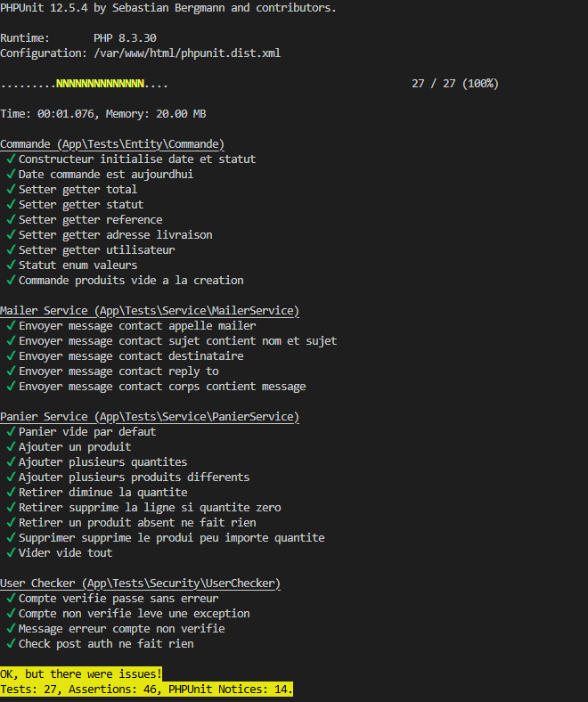

#### Exemple de débogage : correction d'un test

Lors de l'execution des tests, le test `testInscriptionValidé` echouait avec le message _"Les mots de passe ne correspondent pas"_ alors que les deux mots de passe soumis etaient identiques. En lisant le code du test, j'ai identifié que le champ de confirmation etait envoyé sous le nom `password_confirm`, alors que le contrôleur attendait `confirmPassword`. Apres correction du nom du champ dans le fichier de test, les 74 tests passent.

---

## 14. Commandes utiles

---

### Docker

```bash
docker compose up -d                     # Démarrer tous les conteneurs en arrière-plan
docker compose down                      # Arrêter et supprimer les conteneurs
docker compose ps                        # Voir l'état des conteneurs
docker compose logs php                  # Voir les logs du conteneur PHP
docker compose exec php bash             # Ouvrir un shell dans le conteneur PHP
docker compose exec mysql bash           # Ouvrir un shell dans le conteneur MySQL
```

### Base de données

```bash
# Toutes ces commandes s'exécutent à l'intérieur du conteneur PHP
docker compose exec php php bin/console doctrine:database:create        # Créer la base de données
docker compose exec php php bin/console doctrine:migrations:migrate      # Appliquer les migrations
docker compose exec php php bin/console doctrine:migrations:status       # Voir l'état des migrations
docker compose exec php php bin/console make:migration                   # Générer une migration après modif d'entité
docker compose exec php php bin/console doctrine:fixtures:load           # Charger les fixtures (données de test)
docker compose exec php php bin/console doctrine:schema:validate         # Validér le schéma Doctrine
```

### Cache et assets

```bash
docker compose exec php php bin/console cache:clear                      # Vider le cache Symfony
docker compose exec php php bin/console cache:clear --env=prod           # Vider le cache en production
docker compose exec php php bin/console tailwind:build                   # Recompiler Tailwind CSS
docker compose exec php php bin/console asset-map:compile                # Recompiler les assets JS
docker compose exec php php bin/console assets:install                   # Installer les assets des bundles
```

### Génération de code (MakerBundle)

```bash
docker compose exec php php bin/console make:entity                      # Créer ou modifier une entité
docker compose exec php php bin/console make:controller                  # Créer un controller
docker compose exec php php bin/console make:twig-component              # Créer un Twig Component
docker compose exec php php bin/console make:factory                     # Créer une Foundry Factory
docker compose exec php php bin/console make:test                        # Créer un fichier de test
```

### Tests

```bash
docker compose exec php php bin/phpunit                                  # Lancer tous les tests
docker compose exec php php bin/phpunit --testdox                        # Affichage lisible des résultats
docker compose exec php php bin/phpunit tests/Service                    # Lancer un dossier de tests uniquement
docker compose exec php php bin/phpunit tests/Controller/PanierControllerTest.php  # Un seul fichier
docker compose exec php php bin/phpunit --filter testAjoutérProduit      # Un seul test par nom
```

### Débogage

```bash
docker compose exec php php bin/console debug:router                     # Voir toutes les routes
docker compose exec php php bin/console debug:container                  # Voir tous les services
docker compose exec php php bin/console debug:twig                       # Voir les fonctions/filtrés Twig disponibles
docker compose exec php php bin/console debug:config                     # Voir la configuration active
```

### MySQL (accès direct)

```bash
docker compose exec mysql mysql -u root -proot                           # Ouvrir le client MySQL
docker compose exec mysql mysql -u root -proot samyDessert               # Ouvrir directement la base
# Interface graphique : http://localhost:8081 (Adminer)
```

---

## 15. Gestion de version avec Git

---

### 15.1 Pourquoi Git

Git est le système de contrôle de version utilisé tout au long du projet. Il permet de conserver l'historique complet de chaque modification du code, de revenir à un état antérieur en cas de problème, et d'organiser le travail en branches indépendantes.

Dans le cadre d'un projet professionnel, Git est un outil incontournable : il garantit la traçabilité du code, facilite la collaboration et sécurise le déploiement.

### 15.2 Stratégie de branches

Le projet utilisé deux branches principales :

| Branche | Rôle |
|---------|------|
| `main` | Code stable, branché sur Railway → déploiement automatique en production |
| `dev` | Branche de développement au quotidien |

**Principe :**  
Tout le développement se fait sur `dev`. Quand une fonctionnalité est terminée et testée, elle est fusionnée dans `main`. Railway détecte le push sur `main` et redéploie automatiquement le site.

```
dev  →  (développement)  →  merge dans main  →  Railway redéploie
```

Cela garantit que le site en production reste toujours stable, même pendant le développement de nouvelles fonctionnalités.

**Pourquoi deux branches ?**  
Si on travaille directement sur `main` et qu'on envoie un bug, le site en production est immédiatement impacté. Avec `dev`, on peut casser des choses, tester, corriger, et ne déployer que ce qui fonctionne. C'est une pratique standard dans les projets professionnels.

### 15.3 Commandes Git utilisées

**Commandes du quotidien (sur `dev`) :**

```bash
git status                       # Voir quels fichiers ont été modifiés depuis le dernier commit
git add nom-du-fichier           # Marquer un fichier comme "prêt à être commité"
git commit -m "feat: ..."        # Enregistrer les modifications avec un message descriptif
git push origin dev              # Envoyer les commits locaux vers GitHub (branche dev)
```

**Basculer entre les branches :**

```bash
git checkout dev                 # Se placer sur la branche dev pour développer
git checkout main                # Se placer sur la branche main (attention : c'est la prod)
git checkout -b nouvelle-branch  # Créer une nouvelle branche et s'y placer immédiatement
```

**Mettre `dev` à jour avec ce qui a été fait sur `main` :**

```bash
git checkout dev                 # Se placer sur dev
git merge main                   # Intégrer les derniers changements de main dans dev
git push origin dev              # Envoyer la mise à jour vers GitHub
```

**Déployer en production (fusionner `dev` dans `main`) :**

```bash
git checkout main                # Se placer sur main (branche de production)
git merge dev                    # Intégrer toutes les modifications de dev dans main
git push origin main             # Envoyer vers GitHub → Railway redéploie automatiquement
```

**Historique :**

```bash
git log --oneline                # Voir la liste des commits (une ligne par commit)
```

### 15.4 Conventions de commit

Les messages de commit suivent une convention lisible :

| Préfixe | Usage |
|---------|-------|
| `feat:` | Nouvelle fonctionnalité |
| `fix:` | Correction de bug |
| `refactor:` | Restructuration du code sans changement de comportement |
| `style:` | Modification visuelle (CSS, UI) |
| `docs:` | Documentation |

Exemple : `feat: ajout du système d'avis avec note moyenne`

---

## 16. Déploiement

---

### 16.1 Environnement de développement avec Docker

Le projet est entierement contenerise avec **Docker Compose**. L'ensemble des services necesaires au fonctionnement du projet est défini dans un seul fichier `docker-compose.yml`, ce qui permet de démarrér l'environnement complet en une seule commande, sans installation locale de PHP, MySQL ou Nginx.

```
┌─────────────────────────────────────────────────────────┐
│                    Docker Compose                        │
│                                                          │
│  Navigateur → nginx:8080 → php-fpm → Symfony            │
│                                ↓                         │
│                           mysql:3306                     │
│                                                          │
│  Adminer    → :8081 (interface graphique DB)            │
│  Assets     → tailwind:build en bouclé (watch)          │
│  Init       → composer install + migrations (1 fois)    │
└─────────────────────────────────────────────────────────┘
```

**Les 6 services Docker :**

| Service | Image | Rôle | Port expose |
|---------|-------|------|-------------|
| nginx | nginx:alpine | Serveur web, proxie les requêtes vers PHP | 8080 |
| php | Image custom PHP-FPM 8.3 | Execute Symfony | — |
| mysql | mysql:8.0 | Base de données | 3307 |
| adminer | adminer | Interface web de gestion DB | 8081 |
| init | Image custom PHP | Installation initiale (composer, migrations) | — |
| assets | Image custom PHP | Recompile Tailwind + AssetMapper en bouclé | — |

Le service **init** ne s'execute qu'une seule fois au premier demarrage (`restart: "no"`). Il effectue : `composer install`, `doctrine:database:create`, `doctrine:migrations:migrate`, `assets:install`.

Le service **assets** recompile Tailwind CSS et AssetMapper en bouclé toutes les 3 secondes. Ce mecanisme est nécessaire car `inotify` (watch fichiers natif Linux) ne fonctionne pas avec les volumes Docker sur Windows.

```bash
docker compose up -d
# Site disponible sur http://localhost:8080
# Adminer disponible sur http://localhost:8081
```

### 16.2 Variables d'environnement

Les secrets et configurations d'infrastructure ne sont jamais commites dans le code. Ils sont définis dans `.env.local` (ignore par Git) :

| Variable | Description |
|----------|-------------|
| `DATABASE_URL` | Chaine de connexion MySQL |
| `APP_SECRET` | Cle de sécurité Symfony (CSRF, sessions) |
| `MAILER_DSN` | Configuration Mailtrap pour les emails de test |
| `STRIPE_SECRET_KEY` | Cle privee Stripe (mode test) |
| `STRIPE_PUBLIC_KEY` | Cle publique Stripe |

### 16.3 Déploiement en production sur Railway

Le site est deploye en production sur **Railway** via Docker. Railway detecte automatiquement le `Dockerfile` a la racine du projet et reconstruit l'image a chaque push sur la branche `main`.

**URL de production :** `https://samydessert-production.up.railway.app`

#### Architecture de déploiement

```
GitHub (branche main)
       ↓ push
Railway detecte le changement
       ↓ build
Dockerfile → image Docker
       ↓ run
start.sh → doctrine:schema:update → php -S 0.0.0.0:$PORT
```

Le fichier `docker/start.sh` est execute au demarrage du container. Il synchronise le schema de base de données puis lance le serveur PHP.

#### Variables d'environnement sur Railway

Les secrets sont configures dans l'interface Railway (onglet Variables) et injectes automatiquement dans le container :

| Variable | Description |
|----------|-------------|
| `APP_ENV` | `prod` |
| `APP_SECRET` | Cle de sécurité Symfony |
| `DATABASE_URL` | Connexion au service MySQL Railway |
| `MAILER_DSN` | Service email (SMTP Railway) |
| `STRIPE_SECRET_KEY` | Cle privee Stripe |
| `STRIPE_PUBLIC_KEY` | Cle publique Stripe |
| `STRIPE_WEBHOOK_SECRET` | Secret du webhook Stripe |

#### Limite connue : performances

Le serveur utilisé `php -S` (serveur de développement PHP intégré), qui est **mono-thread** : il traite une seule requête a la fois. Cette limite est acceptable dans le cadre d'un projet de formation.

En production reelle, on utiliserait **FrankenPHP** ou **Nginx + PHP-FPM** qui traitent plusieurs requêtes en parallele. C'est une évolution identifiée mais non prioritaire pour la soutenance.

#### Limite connue : emails

Railway bloque les connexions SMTP sortantes (ports 25, 465, 587). Les emails transactionnels (confirmation de commande, inscription) ne peuvent donc pas passer par un serveur SMTP classique. La solution prevue est d'utiliser **Resend**, un service d'envoi d'emails via API HTTP (`resend+api://`), non bloque par Railway.

---

## 17. Évolution du projet

---

Ce projet a été conçu pour etre evolutif. Plusieurs axes d'amélioration ont été identifiés, classes par priorité et impact.

### 17.1 Perspectives futures

Ces fonctionnalités n'ont pas été développées dans le cadre du projet de formation, mais représentent des évolutions naturelles pour une mise en production réelle :

| Fonctionnalité | Description |
|----------------|-------------|
| Moderation des avis | Interface admin pour valider ou rejeter les avis avant publication (actuellement validés automatiquement) |
| Emails en production | Configurer Resend (API HTTP) pour remplacer SMTP — l'envoi d'emails depuis Railway nécessite un service dédié |
| Calendrier commandes | Vue calendrier dans l'administration pour visualiser les commandes jour par jour |
| Variations de produits | Options par produit (taille, parfum, personnalisation) avec un prix différent |
| Recettes proposées par les utilisateurs | Formulaire de soumission de recette côté client, avec modération avant publication |
| Barre de recherche recettes | La barre de recherche existe pour les produits mais pas encore pour les recettes |

### 17.2 Améliorations techniques

| Amélioration | Explication |
|--------------|-------------|
| Webhook Stripe | ✅ Implementé : la commande est créée avant la redirection Stripe, le webhook `/webhook/stripe` reçoit l'événement `checkout.session.complèted` et confirme la commande + envoie l'email, meme si l'utilisateur ferme le navigateur |
| Expiration des tokens d'email | Les tokens de vérification n'expirent pas actuellement. Il faudrait ajouter un champ `tokenExpiresAt` et invalider les tokens de plus de 24h |
| Anti-spam contact | Ajoutér un honeypot ou un rate limiting sur le formulaire de contact pour eviter les soumissions automatisees |
| Upload images en front | Permettre a l'administrateur d'uploader des images directement depuis une interface simplifiée, sans passer par EasyAdmin |
| Internationalisation | Traduire le site en anglais via le composant `symfony/translation` |

### 17.3 Infrastructure et déploiement

| Amélioration | Explication |
|--------------|-------------|
| CI/CD | Mettre en place un pipeline GitHub Actions : lancer les tests automatiquement a chaque push, déployer en production si tout passe |
| Stockage images externe | Migrer les uploads vers AWS S3 ou Cloudflare R2 pour que les images ne soient pas perdues lors d'un redeploi |
| Environnement de staging | Ajoutér un environnement de pre-production pour tester les changements avant de les pousser en production |

---

## 18. Bilan et conclusion

---

A travers ce projet, j'ai appris a m'auto-former et a m'adapter a un environnement technologique en constante évolution. J'ai developpe ma capacite a apprendre de nouveaux langages, a lire et comprendre la documentation technique, et a utiliser des outils modernes, y compris des outils d'intelligence artificielle comme support d'apprentissage et de développement.

Ce projet m'a permis de comprendre en profondeur la conception d'un site e-commerce, ainsi que les attentes liées au metier de web designer.

Une attention particuliere a été portee a l'accessibilité, afin de rendre les outils web utilisables par tous. J'ai ainsi travaille sur le choix des couleurs, des contrastes, de la typographie, et sur la structuration des interfaces pour garantir une bonne lisibilite et une navigation claire.

**Ce que j'ai appris**

J'ai appris a analyser des sites conçurrents afin d'identifier les bonnes pratiques. Le projet m'a permis de travailler sur le responsive design, la structuration d'un projet scalable, la decoupe des éléments d'interface, l'utilisation d'un design system sur Figma, la création d'un logo avec Affinity Designer, et l'accessibilité avec des outils comme userpersona.dev et BlooAI.

**Difficultés rencontrees**

L'une des principales difficultés concerne l'utilisation de Twig Components. Cette approche est interessante pour structurer l'interface avec Symfony, mais je l'ai trouvee moins souple que des solutions comme React pour les interfaces tres dynamiques. Certains cas n'avaient pas été anticipes des le depart : options manquantes, variantes oubliées, besoins d'accessibilité a ajouter. Cela m'a oblige a revenir sur certains composants.

La prise en main de Symfony a également represente un defi important. Le framework est tres puissant mais propose un grand nombre de concepts a assimiler (services, sécurité, événements, configuration). La transition vers Tailwind v4 a aussi necessite une adaptation.

Un probleme technique notable a été une recursion infinie dans les composants Twig, qui m'a oblige a mettre en oeuvre une méthodologie de débogage par isolation progrèssive pour en identifier la cause exacte.

**Exemple : Bug OOM BlockStack** — `Error: Allowed memory size of 1073741824 bytes exhausted` sur les pages `/recettes` et `/produits/{slug}`. La stack trace pointait vers `vendor/symfony/ux-twig-component/src/BlockStack.php`. La cause etait un commentaire Twig `{# #}` **imbrique** dans `Badge.html.twig` qui fermait prematurement le commentaire externe, laissant les exemples d'utilisation etre compiles comme du vrai code Twig. Badge s'appelait alors lui-meme 4 fois a chaque rendu, chaque appel declenchant 4 autres appels, provoquant une recursion infinie. Le fix a consiste a supprimer le `{# #}` imbrique. La technique de débogage : commenter tout le ``, puis rajouter les éléments un par un jusqu'a identifier celui qui declenchait le crash.

**Points reussis**

Le point que je considere comme le plus reussi est la partie UI/UX design ainsi que l'intégration de l'accessibilité des la conception. J'ai accorde une attention particuliere a la lisibilite, aux contrastes, a la typographie et a la navigation clavier, afin de rendre l'interface accessible au plus grand nombre.

Le projet SamyDessert est un projet e-commerce structure, combinant conception UX/UI, accessibilité et développement moderne. Il permet de proposer une expérience utilisateur claire, en offrant a la fois la consultation de recettes et la commande de desserts.

Ce projet demontre ma capacite a concevoir, structurer et développer une application web complète en respectant les bonnes pratiques actuelles : separation des responsabilites (MVC), composants réutilisables (Atomic Design), sécurité (CSRF, hachage, vérification email), accessibilité (ARIA, contrastes, clavier) et performance (assets compiles, lazy loading).

---

## 19. Remerciements

---

Je tiens a remercier chaleureusement toutes les personnes qui m'ont accompagne tout au long de ce projet.

**Stephane ASSABY**, mon formateur a l'ESRP Auxilia de Nanterre, pour son suivi pedagogique, sa disponibilite et ses conseils tout au long de la formation. Ses retours m'ont permis de progrèsser et de prendre du recul sur mes choix techniques.

**Miguel Sevilla** et **Jean-Baptiste Guerin**, mes tuteurs de stage au sein de l'association Creative Handicap, pour m'avoir accueilli dans un environnement professionnel stimulant. Leurs retours d'expérience m'ont aide a mieux comprendre les attentes du metier, a structurer ma démarche de développement et a gagner en autonomie.

Plus généralement, je remercie l'ensemble de l'equipe d'Auxilia et de Creative Handicap pour leur accompagnement bienveillant et leur engagement en faveur de la formation et de l'inclusion numerique.
